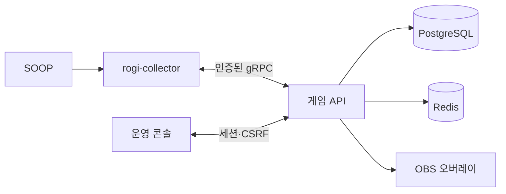

# 구조와 데이터 흐름

Rogimarble은 웹 콘솔, 게임 API, PostgreSQL, Redis, OBS 오버레이로 구성됩니다. 별도 서비스인 [rogi-collector](https://github.com/h66rogi/rogi-collector)가 SOOP 연결과 수집을 담당합니다.

## 권한과 상태

API는 게임 결과의 단일 결정자입니다. 주사위, 이동, 미션, 재고와 운영 보정은 서버 명령으로 확정하고 기록합니다. 브라우저의 애니메이션 종료나 OBS 연결 상태는 게임 결과를 확정하지 않습니다. 원인 후원과 수동 명령은 서로 다른 출처로 저장됩니다.

운영자는 접근 토큰으로 로그인합니다. 로그인 후 서버 세션은 HttpOnly 쿠키로 전달되고, 쓰기 요청은 CSRF 검사를 거칩니다. 채널 권한은 조회와 운영 작업에 적용됩니다. OBS 주소는 별도의 읽기 전용 토큰으로 보호하며, 회전하면 이전 주소는 무효가 됩니다.

## 데이터 경계

- PostgreSQL은 채널 설정 버전, 세션, 게임 결과, 명령, 후원 inbox, 원장과 오버레이 배치를 저장합니다.
- Redis는 실시간 전달에 사용합니다. 저장된 게임 상태는 클라이언트 재연결 시 서버에서 다시 읽습니다.
- collector와 게임 API는 데이터베이스를 공유하지 않습니다. 수집 이벤트는 채널과 cursor를 포함한 gRPC 계약으로 전달합니다.
- 설정 초안과 게시본은 별도 버전입니다. 세션은 시작 시 선택된 보드와 규칙의 의미를 유지합니다.

코드의 타입 정의는 `packages/game-core/src`, `packages/contracts/src`, API 계약은 `apps/api/src/app.controller.ts`와 `apps/api/src/collector.controller.ts`에 있습니다.

## 요청 흐름

1. collector가 채널의 후원 또는 채팅 이벤트를 수집하고 인증된 gRPC 연결로 API에 전달합니다.
2. API는 중복 여부와 채널 연결을 확인한 뒤 원천 이벤트를 저장합니다.
3. 후원 개수가 게시된 규칙에 정확히 일치하면 서버가 명령과 결과를 기록합니다.
4. 운영 콘솔은 상태와 기록을 다시 읽고, OBS 화면은 읽기 전용 상태와 연출을 표시합니다.

운영자가 직접 조작할 때도 서버 명령·원장·상태 갱신 경로를 사용합니다. 후원 이벤트를 만들어 수동 조작을 흉내 내지 않습니다. 클라이언트가 응답을 잃은 경우 저장된 명령 ID로 결과를 조회하며 새 명령을 무조건 재전송하지 않습니다.

## 배포 경계

로컬 Compose는 웹·API·PostgreSQL·Redis·Caddy를 한 프로젝트로 실행합니다. 운영 Compose는 별도 데이터 볼륨과 런타임 secret, 마이그레이션·readiness 검사, digest 이미지 입력을 사용합니다. collector는 독립 제품으로 배포되고 Rogimarble의 데이터베이스나 Redis에 직접 접속하지 않습니다.
