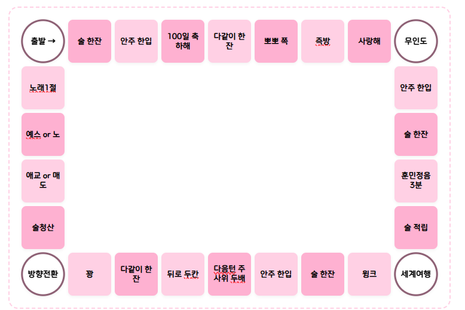

# 스트리머 기준 보드와 편집 가능한 동작 타입

작성: 2026-09-21. [최종 설계](final-design.md)의 보드 명세다.
이번 방송의 초기 판은 아래 전달 이미지를 기준으로 한다. 이미지 전체를 배경으로 붙이는 방식으로
구현하지 않고, 칸·표시·이동 경로·동작·중앙 콘텐츠를 각각 편집 가능한 데이터로 저장한다.

**현재 구현:** [보드 타입·검증·좌표/경로 미리보기](../packages/game-core/src/board-definition.ts),
[26칸 초기 JSON 프리셋](../presets/streamer-board.json), 코어 회귀 테스트.
**후속 구현:** 웹 보드 편집기, DB 저장·게시, 실제 게임 효과 실행기, OBS/Lottie 렌더러.
이 문서와 타입 정의가 있다는 것만으로 특수칸이 실제 게임에서 실행되는 상태는 아니다.

## 1. 이미지에서 확정한 구조

가로 9열·세로 6행 격자의 외곽에 26칸이 있다. 출발은 좌측 상단이며 화살표가 오른쪽을 가리킨다.
기본 이동은 위쪽 왼쪽→오른쪽, 오른쪽 위→아래, 아래쪽 오른쪽→왼쪽, 왼쪽 아래→위 순서다.
외곽 칸 수는 `2 × (열 + 행) − 4`이며 중앙 격자를 게임 칸으로 자동 채우지 않는다.
네 모서리는 원형, 나머지 칸은 분홍색 계열의 둥근 사각형이다. 색상·모양 역시 설정값이다.

좌표 프리셋은 이미지의 778×519을 논리 canvas로 사용한다. 초기 gap 6, padding 상/우/하/좌
33/46/24/36에서 각 격자 슬롯은 72×72다. 이는 시작 디자인 값이며 엔진 상수가 아니다.
현재 운영 프리셋은 같은 9×6 외곽 26칸과 stable ID를 유지하면서 방송용 1920×1080 canvas,
gap 14, 사방 padding 40으로 확장했다. 슬롯은 192×155이며 원본 이미지의 778×519 수치는 조사 근거로만 남긴다.
같은 모양이 반복되어도 모든 칸은 별도의 stable cellId를 가진다. 표시 번호는 ID나 배열 index와 분리한다.

| 표시 번호 | 위치/표시 문구 | 초기 도착 동작 |
| --- | --- | --- |
| 1 | 좌상단 · 출발 → | `none`; 출발점 ID로 사용, 자동 보상 없음 |
| 2 | 위 · 술 한잔 | `mission` |
| 3 | 위 · 안주 한입 | `mission` |
| 4 | 위 · 100일 축하해 | `mission`; 날짜 계산 기능을 이름에서 추론하지 않음 |
| 5 | 위 · 다같이 한잔 | `mission` |
| 6 | 위 · 뽀뽀 쪽 | `mission` |
| 7 | 위 · 즉방 | `mission` |
| 8 | 위 · 사랑해 | `mission` |
| 9 | 우상단 · 무인도 | `movement_lock`; 3회 쉬기 또는 더블 탈출 |
| 10 | 오른쪽 · 안주 한입 | `mission` |
| 11 | 오른쪽 · 술 한잔 | `mission` |
| 12 | 오른쪽 · 훈민정음 3분 | `mission`, durationSeconds 180 |
| 13 | 오른쪽 · 술 적립 | `counter_add`; 술 카운터 +1잔 |
| 14 | 우하단 · 세계여행 | `choose_destination`; 다음 차례에 원하는 칸으로 |
| 15 | 아래 · 윙크 | `mission` |
| 16 | 아래 · 술 한잔 | `mission` |
| 17 | 아래 · 안주 한입 | `mission` |
| 18 | 아래 · 다음턴 주사위두배 | `modify_roll`; 다음 주사위 이동 거리 ×2, 1회 |
| 19 | 아래 · 뒤로 두칸 | `move_steps`, 2칸, against_current |
| 20 | 아래 · 다같이 한잔 | `mission` |
| 21 | 아래 · 꽝 | `none` |
| 22 | 좌하단 · 방향전환 | `set_direction`, toggle |
| 23 | 왼쪽 · 술청산 | `counter_settle`; 적립 잔 수 전부를 한 번에 수행하는 미션 |
| 24 | 왼쪽 · 애교 or 매도 | 우선 `mission`; 선택 UI를 원하면 `choice_mission`으로 편집 |
| 25 | 왼쪽 · 예스 or 노 | 우선 `mission`; 선택 UI를 원하면 `choice_mission`으로 편집 |
| 26 | 왼쪽 · 노래1절 | `mission` |

문구는 표시 데이터다. `방향전환`이라는 이름을 `역주행`으로 바꿔도 저장한 동작이 유지되어야 하고,
반대로 동작 타입을 미션으로 바꾸면 이름에 관계없이 미션만 생성해야 한다.
초기 일반 미션은 운영자 확인 방식과 실드 불허를 **편집 가능한 제안값**으로 둔다.
음주 관련 칸의 실드 허용·비용은 웹에서 각각 지정한다. 이미지에 실드 정책이 있다고 추정하지 않는다.

`뒤로 두칸`의 초기 제안은 현재 방향의 반대로 2칸, 통과 효과 생략, 도착 칸 효과 실행이다.
`방향전환`은 다음 미확정 이동부터 정/역방향을 바꾼다. 운영자가 정방향 고정·역방향 고정으로 바꿀 수도 있다.
훈민정음은 180초 미션 표시이며 발화를 자동 판정하는 기능을 의미하지 않는다.
별풍선 33/52/53/100/101/152/486 규칙은 별도 [후원 프리셋](../presets/streamer-initial.json)을 유지한다.
보드의 `술 한잔` 칸이나 `방향전환` 칸이 후원 규칙에 자동 등록되지는 않는다.

### 1.1 답변으로 확정한 규칙과 초기 설정

사용자가 확정한 의미는 **무인도·세계여행은 부루마블 방식**, **적립은 도착마다 1잔**,
**청산은 적립 전량을 한 번에 수행**, **두 배는 다음 주사위 이동 거리 ×2**다.
아래 차례/선택/실드 처리의 세부값은 이를 방송의 공유 말에 적용하기 위한 편집 가능한 초기 설계다.

| 항목 | 이번 프리셋과 실행 기준 |
| --- | --- |
| 무인도 | 도착 이후 최대 3회 쉬기. 각 차례에 두 주사위가 같은 눈이면 즉시 해제하고 그 합만큼 이동. 3회 모두 실패하면 다음 차례부터 정상 이동 |
| 세계여행 | 다음 차례의 주사위 이동을 원하는 칸으로 직접 이동하는 행동으로 대체. 도착 효과 실행, 통과 효과 없음 |
| 술 적립 | 공유 세션의 `drink-bank` 카운터를 1잔 증가. 후원 금액의 잔액 누적과 무관 |
| 술청산 | 사용 가능한 적립량 전부를 snapshot으로 잡아 미션 1개 생성. 3잔이면 수량 3인 미션 하나이며 세 번의 독립 미션으로 나누지 않음 |
| 다음턴 주사위두배 | `movement_multiplier`, factor 2, uses 1. 합계 5이면 10칸; 이동 결과 확정과 함께 횟수 소모 |

부루마블의 무인도 3회 휴식/더블 탈출과 다음 차례 여행은
[공개 규칙 요약](https://skyreview.tistory.com/m/381)과
[시리즈 규칙 설명](https://m.namu.moe/w/부루마불/시리즈)을 교차 확인했다.
제조사 사이트는 열람이 차단되어 공식 설명서 원문을 직접 검증하지 못했다. 이 문서는 특정 판본을
그대로 재현한다고 주장하지 않으며, 위 기본 규칙을 아래 방송용 차례 계약에 연결한다.
재산·통행료·여행 요금·추가 후원 요구는 이 주루마블 모델에 도입하지 않는다.

이번 보드의 정상 이동은 **6면 주사위 1개**를 사용한다. 무인도의
`skip_rolls_or_doubles` 판정만 정상 주사위 개수와 독립적으로 같은 면 수의 주사위 2개를 굴려
더블 여부를 확인하고, 성공하면 두 눈의 합으로 이동한다. 따라서 정상 주사위 개수를 1로 둔 보드도
무인도 더블 탈출과 모순되지 않으며 게시 검증에서 허용한다.
일반 굴림의 더블 추가 차례는 이번 프리셋에 추가하지 않는다. 33개 후원은 여전히 정상 차례 1회 요청이다.

여기서 **차례는 후원 규칙 또는 운영자가 요청한 정상 굴림 한 회가 실행될 기회**다.
미등록 후원, 실드 지급, 문구 미션, 486 직접 이동, 연출 재생, 시간 경과는 차례를 소모하지 않는다.
연차의 각 index도 차례이지만 repeat_roll 효과가 만든 child는 추가 정상 차례로 세지 않는다.
무인도 도착을 유발한 현재 차례는 휴식 3회에 포함하지 않는다.

## 2. 타입의 책임 분리

| 타입/필드 | 관리 대상 | 게임에 미치는 영향 |
| --- | --- | --- |
| `BoardDefinition.canvas` | 논리 너비·높이·배경색 | 같은 칸의 화면 좌표·크기만 변경 |
| `BoardLayout` | 외곽 격자의 행/열/gap/padding 또는 자유 배치 | 칸 배치 방식 |
| `BoardCell.position` | grid 행/열 또는 freeform 정규화 사각형 | 표현 위치, cellId 유지 |
| `BoardDefinition.path` | stable cellId의 순환 순서 | 정/역방향 이동의 논리 경로 |
| `BoardDefinition.dice` | 주사위 개수·면 수 | 정상 굴림에서 각 눈을 합산; 새 세션 기본값 |
| `startCellId`, `defaultDirection` | 출발 칸·새 세션 기본 방향 | 세션 초기 상태 |
| `BoardCell.label`, `CellAppearance` | 문구·원형/사각형·색상·이미지/Lottie 참조 | 표현만 변경 |
| `BoardCell.onLand` | 도착 시 순서대로 처리할 typed effect 목록 | 이동·미션·방향·보상 등 실제 동작 |
| `BoardCell.onPass` | 지나간 칸의 효과 | 경로를 바꾸지 않는 미션·적립·지급 |
| `BoardWidget` | 중앙/판 위의 주사위·문구·보상 현황 등 | 표시용이며 게임 칸/효과가 아님 |
| `BoardDefinition.counters` | 적립 수량의 정의·단위·초기값 | 실제 현재 값은 세션 상태에 저장 |

`BoardLayout`은 `perimeter_grid`와 `freeform`을 구분하는 union이다.
`BoardEffect`도 `type`별 필수 매개변수가 다른 union이다. 임의 `Record<string, any>`나 함수 문자열로
동작을 저장하지 않는다. JSON에는 종류와 값만 있고 서버 실행기가 해당 종류를 처리한다.
동일 기능은 후원·보드·운영자 명령에서 같은 게임 서비스/원장으로 이어진다.

지금 정의한 primitive의 조합·값·순서를 바꾸는 데 재배포가 필요하지 않게 한다.
새로운 primitive 자체를 추가할 때는 타입·JSON 검증·관리 폼·서버 handler·회귀 테스트를 함께 추가한다.
서버가 모르는 type을 단순 미션이나 아무 동작 없음으로 조용히 대체하지 않는다.

## 3. 도착 동작 타입과 매개변수

| effect type | 입력값 | 실행 계약 |
| --- | --- | --- |
| `none` | 없음 | 기록/연출만 하고 추가 게임 효과 없음 |
| `mission` | message, shield, durationSeconds | 미션 생성; 실드 정책과 타이머 snapshot |
| `choice_mission` | prompt, selection, choices | 운영자/원인 후원자의 선택 후 한 미션 생성 |
| `move_steps` | steps, direction, onPass, onArrival | 저장된 경로로 추가 이동; 통과·도착 효과 각각 선택 |
| `choose_destination` | selection, allowedCellIds 또는 전체, onArrival, timing, excludeCurrentCell | 즉시/다음 차례 이동; 현재 칸 제외·원인 후원자 ID 검증 |
| `set_direction` | forward / reverse / toggle | 현재 이동 결과 유지, 다음 미확정 이동의 방향 변경 |
| `movement_lock` | release: operator / skip_rolls / dice_faces / skip_rolls_or_doubles | 이동 제한과 해제 조건·남은 횟수를 상태로 저장 |
| `modify_roll` | uses, modifier | 아직 실행하지 않은 다음 대상 주사위에 제한 횟수 적용 |
| `counter_add` | counterId, quantity | 세션의 지정 카운터에 적립 |
| `counter_settle` | counterId, message, shield, settleOn | 적립 snapshot으로 정산 미션과 처리 기록 생성 |
| `grant_item` | itemId, quantity | 기존 아이템 원장으로 지급; 실드 외 아이템도 동일 |
| `unconfigured` | question | 초안의 미확정 의미 보관; 게시/세션 시작에는 허용하지 않음 |

`modify_roll.modifier`는 세 가지 서로 다른 타입이다.

- `movement_multiplier { factor }`: 한 번의 주사위 결과로 이동할 거리를 곱한다.
- `dice_count { count }`: 해당 굴림에서 사용할 주사위 개수를 지정하고 합산한다.
- `repeat_roll { count }`: 해당 요청을 총 count회의 순차 굴림으로 확장한다.

세 경우를 같은 `두 배` 값으로 저장하지 않는다. `uses`는 영향을 받을 정상 굴림의 횟수다.
별풍선 연차의 각 index와 실제 수동 주사위는 정상 굴림으로 취급하지만, repeat_roll이 만든 추가 굴림에
같은 modifier를 재귀 적용하지 않는다. 이동 금지로 실제 굴림이 실행되지 않으면 사용 횟수를 소모하지 않는다.
이동만 하는 486/위치 보정은 modifier를 소모하지 않는다. 서버는 결과와 사용량 차감을 함께 커밋한다.
동일 종류 modifier의 초기 실행 정책은 최신 효과로 교체하며 다른 종류는 주사위 수/반복 → 거리 순으로 적용한다.
중첩 방식 확장은 새 스키마 정책으로 추가하고 암묵적으로 곱연산하지 않는다.

movement_lock은 자동 이동을 제한한다. 후원 수락·아이템 지급·운영자 미션 처리는 계속 가능하다.
skip_rolls는 정상 굴림 기회를 지정 횟수만큼 건너뛰며 결과에 `제한으로 건너뜀`을 기록한다.
dice_faces는 기본 면 수의 주사위 한 개로 별도 해제 판정을 하며 초기 계약에서는 해제만 한다.
skip_rolls_or_doubles는 정상 주사위 개수와 무관하게 기본 면 수의 주사위 두 개로 판정하며 실패 시 잔여 횟수 1을 차감한다.
`onDoubles=move_sum`이면 성공 눈의 합으로 이동하고 `release_only`면 해제만 한다.
판정에는 dice_count/repeat_roll을 적용하지 않고 남겨 둔다. 이동이 생긴 성공 판정에는 대기 중인
movement_multiplier를 적용·소모하고 실패/해제만 한 경우에는 소모하지 않는다.
마지막 실패도 휴식 차례이며 새로 굴려 이동하는 것은 다음 차례다. 결과·잔여 횟수·해제를 함께 영속 저장한다.

무인도 중 486 등 직접 이동은 요청을 보존하고 제한 해제 뒤 처리한다. 이 요청 때문에 뒤의 정상 차례까지
막혀 탈출 판정을 못 하는 교착을 만들지 않는다. 큐는 제한으로 보류한 직접 이동을 건너뛰어 정상 차례의
탈출 판정을 처리하며, 해제 후 기존 직접 이동을 원래 순서로 재개한다. 이 사유/순서를 콘솔에 표시한다.
강제 위치 보정은 제한 유지/해제를 명시하고, 잔여 제한 조정·즉시 해제는 별도 운영 명령으로 제공한다.

choose_destination의 immediate는 선택 확정 뒤 실행하고, next_turn은 도착 시 여행 예약을 만든다.
다음 정상 차례가 예약을 소비하면 주사위를 굴리지 않고 목적지로 이동한다. 그 차례에 연결된 원본 후원은
`세계여행으로 대체` 결과를 남기며 원인 도착 action과 소비한 turnId를 모두 연결한다.
도착 후 미리 목적지를 입력할 수 있으나 다음 차례 전에는 실제 이동하지 않는다. 입력이 없다면 다음 차례를
영속 예약한 채 선택을 기다린다. 이후 주사위가 추월하지 못하게 하고 입력 만료는 이 시점부터 계산한다.
취소/만료 시 여행 예약을 닫고 아직 굴리지 않은 원래 차례를 같은 ID로 정상 진행하도록 반환한다.
일시정지 중 선택해도 이동은 대기한다. 위치 보정만으로 예약을 소모하지 않는다.

초기 여행 선택은 운영자 또는 **여행 칸에 도착하게 한 원인 후원자**가 할 수 있다.
다음 차례를 제공한 다른 후원자가 자동으로 선택권을 가져가지 않는다. 별풍선 486의 선택자는 해당 486 후원자다.
초기 excludeCurrentCell=true는 실제 실행 위치를 후보에서 제외한다. 직접 위치 보정으로 후보가 달라졌으면
목적지를 실행 직전에 재검증하고 필요 시 다시 선택받는다. 이동 배수는 직접 여행 이동으로 소모하지 않는다.

counter_settle은 적립된 사용 가능 수량 전부를 한 번의 미션 안내로 기록하면서 즉시 차감한다.
미션별 완료·면제·실드 사용 확인은 운영 범위에서 제외한다. 미션에는 counterId와 당시 quantity를
남기며 메시지에서 잔 수를 파싱하지 않는다. 총 3잔을 청산하면 3잔을 차감하고 미션 안내를 한 번
기록한다. 이후 새로 적립한 1잔은 다음 청산까지 남는다. 청산할 수량이 0이면 기록만 남기고
빈 미션을 만들지 않는다. 이전 보드 버전에 저장된 `mission_completion` 값도 실행 시 즉시
차감하며, 기존 대기 예약은 데이터 마이그레이션에서 한 번 정산한다.

보드에서 발생한 채팅 선택도 안정적인 원인 donorId를 사용한다. 수동 주사위처럼 원인 후원자가 없는 경우
다른 채팅 작성자를 임의로 지정하지 않는다. both는 운영자 선택을 사용하고 donor_chat 전용이면 운영자에게
수동 해결 필요를 표시한다. 목적지 선택·choice 미션에는 취소·만료·한 번만 확정되는 요청 상태를 둔다.

## 4. 도착·통과·연쇄 효과의 실행 경계

1. 주사위/수동 명령을 영속 수락하고 실제 방향·눈·경로를 저장한다.
2. 경로 중간의 지나간 칸에 onPass, 최종 칸에 onLand를 적용한다. 도착 칸에 둘 다 자동 실행하지 않는다.
3. 같은 칸의 효과는 배열 순서대로 처리하고, 입력 대기/이동 제한은 명시적 상태로 보관한다.
4. 추가 이동은 원본 결과를 덮지 않고 부모 action에 연결된 child 결과를 생성한다.
5. 각 효과의 실행 ID는 root action + 게시한 보드 버전 + 방문 순번 + cellId + trigger + 효과 index로 고정한다.
6. 재시작은 아직 처리하지 않은 효과부터 이어서 실행한다. Lottie callback을 효과 처리 확인으로 사용하지 않는다.

onPass는 none/mission/counter_add/grant_item만 허용한다. 미확정 초안은 보관할 수 있으나 게시할 수 없다.
지나가는 도중 방향/이동/입력 대기를 끼워 넣어 이미 저장한 경로를 바꾸는 설정은 검증에서 거부한다.
onLand는 모든 위 타입을 사용할 수 있다. 출발점 lap 계산은 세션 정책이며 출발 문구나 원형 모양이
별도 보상을 자동 실행시키지 않는다.

추가 이동 후 다시 이동 칸에 도착할 수 있으므로 실행기에 root별 단계 수·총 이동 거리·처리 시간 상한을 둔다.
정적 검사로 찾을 수 있는 자가 목적지/명백한 순환은 게시 전 알리고, 런타임 상한에 닿으면 저장된 마지막 상태에서
멈춰 운영자 확인을 요청한다. 무한 루프를 돌거나 이미 처리한 아이템/미션을 모두 재실행하지 않는다.
현재 코어의 경로 미리보기는 이 실행기를 대신하지 않으며 연쇄 효과도 실행하지 않는다.

## 5. 화면 크기·칸 수·내용 변경

| 변경 | 편집 UI | ID와 게임 처리 |
| --- | --- | --- |
| OBS 표시 크기 | 너비/높이 또는 배율, 비율 유지 | 기존 보드 좌표를 표시 공간으로 변환; 칸 수/경로/효과 유지 |
| 논리 canvas 크기 | canvas width/height와 padding/gap | geometry 재계산; stable cellId와 path 유지 |
| 외곽 행·열 수 | 행/열 입력과 변경 전후 미리보기 | 요구 칸 수 재계산, 추가/제거/재배치 대상을 명시 |
| 자유 배치 | freeform 전환, 칸별 위치/크기 드래그 | 정규화 좌표와 논리 path를 따로 편집 |
| 문구·색·모양·자산 | 칸 선택 후 속성 패널 | label 변경이 동작 변경을 유발하지 않음 |
| 칸 동작 | type 선택 → 해당 필수 입력 폼 | 필요하면 한 칸에 여러 효과, 순서/도착/통과 선택 |
| 중앙 콘텐츠 | 위젯 추가, 크기/위치 조절, 미리보기 | 게임 경로에 포함되지 않음 |

행·열 변경을 width/height 확대와 같은 작업으로 취급하지 않는다. 9×6에서 10×6으로 바꾸면
26→28칸이 필요하다. 기존 26개 ID·내용·참조를 보존하면서 새 2칸의 배치를 확인한다.
축소할 때는 삭제할 칸을 고르고 그 칸을 참조한 start/path/allowedCellIds를 함께 수정한다.
최초 프리셋으로 덮어쓰거나 배열 index로 새 ID를 일괄 발급하지 않는다.
원형은 격자 슬롯 안에서 가로/세로의 작은 값에 맞춘 원으로 그리고 말 anchor는 슬롯 중심을 사용한다.

진행 중 세션은 게시된 BoardVersion snapshot을 고정한다. 행/열·cellId·path·효과 변경은 다음 세션부터
사용하고 대기 주사위/미션/486에 소급 적용하지 않는다. 표시 배율 변경은 가능하지만 이동 중에는
현재 경로의 논리 좌표를 같은 viewport transform으로 다시 계산해야 한다.
canvas/layout 편집도 새 버전으로 저장하고, 즉시 단순 확대가 필요하면 OBS 표시 배율을 사용한다.
진행 중인 세션에 시각·주사위 설정 버전을 바꿔야 하면 새 버전을 별도로 게시한 뒤 이동을 일시정지한다.
서버는 path·stable cell ID·도착/통과 효과·카운터·기본 방향이 기존 버전과 같은 경우에만
`apply_board_version`을 허용한다. 기존 버전과 진행 상태는 덮어쓰지 않으며 명령 원장과 presentation epoch로 전환을 기록한다.

## 6. 중앙 영역과 Lottie

초기 프리셋의 `widgets`는 이미지처럼 빈 배열이다. 웹 편집기에서 중앙 공간에 아래 타입을 추가한다.

| widget type | 콘텐츠 |
| --- | --- |
| text | 보드 제목·안내 문구 |
| image / lottie | 검증한 자산의 assetId |
| dice | 실제 저장된 주사위 결과·연출 |
| current_mission | 현재 미션과 타이머 |
| inventory | 실드 등 보상 현황 |
| donation_alert | 공개 표시를 허용한 후원 알림 |
| direction | 현재 진행 방향 |

위젯 bounds는 전체 canvas에 대한 0~1 좌표다. 편집기는 중앙 영역에 맞춘 배치/스냅을 제공하되
그 영역을 보드 칸으로 만들지 않는다. widgets array 순서는 기본 표시 레이어 순서다.
배경에 Lottie를 넣거나 칸에 artwork를 연결해도 효과 코드/URL을 이미지에 숨기지 않는다.

말의 이동은 path의 cellId → 계산된 anchor → wrapper 좌표 이동 순이다. 말의 점프·걷기·착지는 Lottie가
담당한다. 자산에 특정 보드 좌표를 굽지 않는다. 화면 크기·칸 수·레이아웃을 바꿔도 같은 자산을 쓸 수 있어야 한다.
Three.js 주사위도 같은 저장 결과를 받아 표시하며 보드 칸 타입과 독립이다.

## 7. 검증·게시와 운영 콘솔

`validateBoardDefinition(unknown)`은 JSON의 필드·종류·범위·위치·경로·ID·목적지/카운터 참조를 검사한다.
`assertBoardPublishable(board, resources)`는 미확정 효과·미등록 아이템/자산·주사위 면 범위를 추가 검사한다.
이 함수는 스키마/참조 gate다. 실제 게시 서비스는 사용자 권한·승인된 자산 버전·지원 handler·순환 위험·
운영 미리보기도 검증해야 하며, 타입 검사만 통과했다고 게임을 시작하지 않는다.

초안에서는 미정 타입을 저장·미리보기할 수 있다. 답변을 반영한 현재 프리셋의 26칸은 모두 동작을 지정했으며
스키마/참조 게시 검증을 통과한다. 이후 새 칸에 넣은 unconfigured는 게시 전에 설정해야 한다.
무인도 더블 판정은 서버가 별도 주사위 두 개를 사용한다. 현재 칸 제외 후 후보가 없는 여행 설정은 게시를 거부한다.
이는 실제 효과 실행기와 웹 게시 기능의 구현 완료를 의미하지 않는다.

현재 검증 상한은 외곽 행/열 3~64, 칸 4~256, 칸당 trigger별 효과 16개, 위젯 32개,
canvas 한 변 16,384다. 게임 규칙의 특정 값이 아니라 입력/리소스 보호 한계다.
초기 판은 이 범위 안의 설정값이며 한계 변경은 검증/부하 시험을 거쳐 스키마와 함께 관리한다.

운영 콘솔에는 보드 미리보기와 함께 modifier 남은 횟수·이동 제한·적립/정산·선택 요청을 표시한다.
보상 원장과 별도로 적립 카운터 원장을 두고 수량 조정·정산 취소·제한 해제·modifier 해제도
인증된 운영 명령으로 제공한다. 실드 수량이나 위치를 바꿨다는 이유로 이 상태를 지우지 않는다.

인수 기준:

- 전달 이미지의 26칸 문구·순서·모서리·색상 구분을 초기 프리셋에서 재현한다.
- 출발에서 정방향/역방향 이동과 한 바퀴 복귀가 label·cells 배열 순서에 영향을 받지 않는다.
- canvas 크기 변경은 ID/경로/효과를 보존하고, 행/열 변경은 완전한 재배치 전까지 거부한다.
- 이름/아이콘만 바꿔도 행동은 유지되고, effect type/값 변경은 게시된 새 세션에서만 적용된다.
- 없는 cellId/itemId/counterId/assetId·겹친 슬롯·중앙 격자 칸·미정 타입을 적절한 단계에서 거부한다.
- 뒤로 이동·방향전환·추가 이동 연쇄를 서버와 OBS에서 통합 검증한다.
- 적립 3회→청산은 수량 3인 미션 1개, 정산 대기 중 추가 적립은 보존한다. 예약·방어·면제·취소는 중복 차감하지 않는다.
- 이동 거리 ×2는 다음 실제 주사위 이동 1회만 소비하며 직접 이동/해제 실패는 소모하지 않는다.
- 무인도 더블 성공·3회 실패 후 다음 차례·수동 해제, 세계여행 다음 차례 대체·취소 반환을 재시작 뒤에도 보존한다.
- modifier/정산/선택이 재시도나 두 운영자의 동시 조작에서 두 번 처리되지 않는다.
- Lottie/Three 실패나 해상도 변경으로 실제 위치/아이템/적립 기록이 달라지지 않는다.

기존 후원 판정 코어와 보드 코어의 테스트는 실제 효과 실행·웹 편집·OBS 통합 완료 증거가 아니다.

## 방송 스타일과 실시간 패널 (2026-09-22)

보드 테마는 라임 클로버·핑크 버니·스카이 소다·라벤더 드림·미드나잇 팝·피치 소르베다.
폐기된 클래식 테마는 읽을 때 라임으로 이관하며 새 쓰기에서는 허용하지 않는다.
방송 글꼴은 나눔스퀘어네오·주아·도현·검은고딕을 선택한다. 공식 정적 폰트를 자체 호스팅하고
`next/font/local`로 등록한다. 콘솔의 기본 글꼴은 나눔스퀘어네오를 유지한다.

`overlay-layout`의 `menu`와 `dicePrice`는 표시 설정이다. 메뉴판은 활성 게시 후원 규칙을
그대로 표시하거나 운영자가 입력한 행을 표시한다. 주사위 자동 가격은 정확히 1회를 실행하는
규칙을 선택한다. 후보가 여럿이면 임의 가격을 고르지 않고 명시적으로 선택하게 한다.
직접 입력한 가격과 문구는 후원 매칭/실행 규칙을 변경하지 않는다.

OBS 탭은 meloming-front의 실제 `TotalOverlayLayoutSettings`를 사용한다. 원본의 Rnd 드래그,
크기 조절, 정규화 좌표, 스냅, 150ms 저장, 직렬 저장 큐를 유지한 채 제품 API를 연결한다.
게임판·메뉴판·주사위 가격 등 표시 여부와 위치·크기·겹침 순서는 이곳에서 즉시 저장한다.
이 배치는 게임 세션의 revision과 별도로 단조 증가하는 layoutVersion을 사용하고,
권한·CSRF·예상 버전을 확인한다. 동일 채널의 OBS에 `layout.updated`를 전송한다.
후속 테마/글꼴/내용 게시에서는 이미 저장한 실시간 배치의 위치와 표시 여부를 보존한다.
기존의 보드 칸 배치/동작 게시 계약과는 별개이며 게임 결과나 이동을 만들지 않는다.
