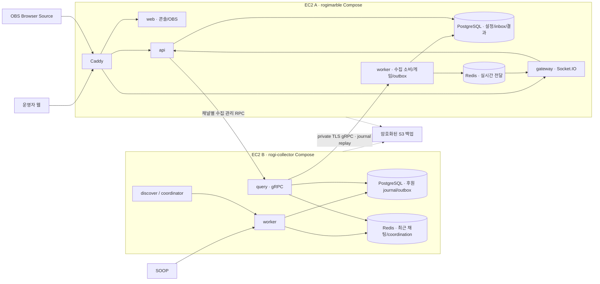

# 주루마블·로기챗 공통 수집기 최종 설계 v1

작성: 2026-09-21. 대상: `h66rogi/rogimarble`, `h66rogi/rogi-collector`.

이 문서는 구현의 기준 설계다. 사용자 확정 요구와 이를 충족하기 위한 기술 결정을 정리했다.
서비스가 모두 구현·배포되었다는 뜻은 아니다. 후원 설정 검증·판정과 보드 코어를 기반으로
웹 콘솔·서버 저장·Lottie·로컬 Compose의 첫 구현을 진행 중이다.
실제 검증 범위와 미완료 항목은 [구현 진행 기록](implementation-status.md)에 관리한다.
구체적인 작업 순서와 완료 기준은 [구현 계획](implementation-plan.md)을 따른다.
기존 [조사 기록](repository-review.md)과 충돌하면 이 최종 설계가 우선한다.
방송 중 관리 페이지의 상세 요구는 [스트리머 운영 콘솔 설계](operator-console.md)에 정의한다.
전달 이미지 기반 초기 판과 타입 계약은 [보드 설계](board-design.md)에 정의한다.

## 1. 결정 요약

| 항목 | 기준 설계 | 근거 |
| --- | --- | --- |
| 제품 경계 | 주루마블 모노레포 + 독립 Go 공통 수집기 | 수집기는 다른 로기챗 제품에서도 소비 |
| 배포 | 제품별 EC2 1대, 총 2대; 각각 Docker Compose | 사용자 요구. 여러 컨테이너가 한 호스트에서 실행 |
| 저장소 | 각 EC2의 독립 PostgreSQL·Redis | 제품 간 DB/Redis 직접 공유 없이 독립 배포·복구 |
| 서버 간 전달 | private IP의 TLS gRPC, 채널별 인증·권한, 후원 journal 재생 | 공통 수집 계약을 제공하고 내부 Redis 구조를 감춤 |
| 게임 | 서버가 결과·공유 말 1개의 상태를 확정 | 재연결·다중 OBS에서도 중복 진행 방지 |
| 후원 | 정확한 별풍선 개수 일치; 연차는 별도 등록 | 배수·잔액 누적 없음 |
| 관리 | 후원 내역·보상 수량·수동 주사위·방향/위치·대기열을 제어하는 운영 콘솔 | 방송 중 모든 게임 운영을 웹에서 수행; 설정·보정·미리보기 구분 |
| 기본 표현 | DOM/SVG 보드 + Lottie + 경로 이동 애니메이션 | 편집 가능한 보드와 풍부한 움직임을 함께 지원 |
| 선택 표현 | Three.js 3D 주사위·입체 효과 | 필요한 장면만 로드; 실패 시 Lottie/정적 표현 |
| IaC | rogichat의 Terraform·호스트 운영 패턴을 선별 활용 | 기존 운영 리소스·Aurora·관리 EC2를 통째로 복제하지 않음 |
| 공개 범위 | 검토한 파일만 새 이력에 반입 | private 원본 전체 및 과거 Git 이력 공개 방지 |

## 2. 제품 규칙과 관리 화면

### 2.1 사용자가 확정한 초기 규칙

| 정확한 별풍선 개수 | 초기 이름 | 동작과 편집 항목 |
| --- | --- | --- |
| 33 | 주사위 굴리기 | 1회 요청. 개수·횟수·연차 허용 편집 |
| 52 | 안주 먹어 | 미션. 문구·확인 방식·연출 편집 |
| 53 | 안주 안돼 | 미션. 문구·확인 방식·연출 편집 |
| 100 | 무조건 한잔해 | 미션. 실드 허용 여부도 편집 |
| 101 | 한잔 실드 | 아이템 지급. 아이템 종류·개수 편집 |
| 152 | 같이 한잔 | 미션. 실드 정책·문구 편집 |
| 486 | 원하는 칸으로 | 운영자 웹 선택·해당 후원자의 채팅 선택 모두 지원 |

이 표는 최초에 가져올 프리셋이다. 런타임은 DB의 채널별 설정을 읽는다.
33을 34로 바꾸면 33의 기존 동작은 사라진다. 미등록 66/99/200/250는 아무 동작도 하지 않는다.
연차를 켜더라도 `정확한 개수 → rollCount` 규칙을 따로 등록해야 하며 나눗셈으로 계산하지 않는다.
한 설정에 활성 여부와 무관하게 개수 중복을 허용하지 않는다. 후원 1건은 규칙 하나에 대응한다.

실드는 공유 세션 인벤토리에 적립한다. 실제 발생한 미션별 완료·면제·실드 사용 확인은 이번 운영 화면 범위에서 제외하고, 발생 내역은 게임 기록에서 읽기 전용으로 확인한다.
미션마다 `불허` 또는 `itemId + 소모 개수`를 저장하며 이름에 따라 예외 처리하지 않는다.
현재 프리셋의 100 실드 불허·152 실드 1개 허용은 **편집 가능한 제안값**이다.
52/53은 우선 운영자가 확인하는 문구 미션으로 표현한다. 지속적인 안주 허용/금지 상태와
그 해제 조건은 스트리머가 설정하기 전까지 추정하지 않는다.

### 2.2 웹 콘솔 범위

**스트리머가 실제 게임을 운영하는 페이지는 첫 출시 필수 기능이다.** 로그인 후 운영 화면에서
후원 내역·현재 보드·보상 수량·수동 조작·대기 작업을 함께 보고 실행할 수 있어야 한다.
설정 폼이나 API만 있는 상태를 관리 페이지 완성으로 보지 않는다.

| 화면 | 운영자가 할 수 있는 일 |
| --- | --- |
| 방송 연결 | 승인된 SOOP 채널 연결·수집 시작/중지, 연결 상태·후원 지연 확인 |
| 실시간 후원 내역 | 후원자·개수·시각·메시지·규칙·처리 결과 조회, 기간/세션/후원자 필터, 무동작/실패 사유 확인 |
| 후원 규칙 | 초기 프리셋 가져오기, 추가/수정/삭제, 활성화, 개수·동작·횟수·문구 지정 |
| 보드 편집 | 초기 26칸 판 가져오기, 화면 크기/행·열/자유 배치, 칸 내용·동작 type/매개변수·중앙 위젯 편집, 새 버전 저장 |
| 적립·특수 상태 | 적립 잔 수 조정·정산/취소, 배수/횟수 조정·해제, 무인도 제한 조정·해제, 여행 예약 처리 |
| 보상·미션 | 실드 등 보상 추가/차감/수량 지정, 아이템 정의·지급량·실드 정책, 변경 이력, 발생 미션의 읽기 전용 기록 |
| 수동 제어 | 실제 주사위 굴리기, 진행 방향 정/역 설정, 칸 선택/번호로 위치 변경, N칸 이동·lap 보정 |
| 게임 운영 | 시작/일시정지/한 건 진행/재개/종료, 대기열 보류·취소·미완료 재시도, 새 세션과 명시적 이월 |
| 원하는 칸 | 대기 요청·후원자·만료 표시, 칸 선택·확정, 채팅 결과 확인 |
| 연출 관리 | Lottie 자산 등록/미리보기, 이벤트별 연결, 색상·크기·속도·길이·품질 설정 |
| 오버레이 설정·복구 | 채널당 하나의 읽기 전용 주소를 자동 생성·재조회·회전하고 통합·파츠별 URL, 권장 크기·스타일·위치, 연결 상태를 관리 |
| 기록·진단 | 원인 후원 → 규칙 버전 → 결과 → 운영 보정 확인, 작업자/전후 값/사유, 가능한 보정 되돌리기 |

오버레이 주소는 멜로밍처럼 채널당 하나만 유효하다. 로그인한 콘솔에서 조회할 때 없으면 한 번 생성하며,
회전하면 이전 주소와 연결은 즉시 무효화된다. 기존에 해시만 저장한 주소는 원문을 복원할 수 없으므로
사용자가 주소를 회전한 뒤 OBS에서 교체한다. 다중 주소에서 이 구조로 이행할 때는 마지막 사용 주소 하나를 남긴다.

운영 화면은 상단 세션/연결 상태, 중앙 보드, 우측 조작·보상 패널, 홈 왼쪽 하단 후원 내역과 대기 작업 탭으로
구성한다. 운영 기록은 개발자도구에서 확인한다. 보드와 조작 패널을 보면서 최근 후원을 확인할 수 있게 한다. 전체 내역은 별도 검색 페이지도 제공한다.
홈 우측 영역의 맨 위 `현재 할 수 있는 액션`은 현재 턴에 필요한 즉시 실행 버튼만 보여 준다. 그 아래는 간격과 별도 배경으로 구분한 Pill Tabs 영역이며, `적립/보상`(적립량·아이템), `게임 조작`(일시정지·방향·활성 효과·종료), `게임 기록`(발생 내역)이 하단 전체를 차지한다. 게임 종료 뒤에도 직전 게임의 기록을 조회한다. 과거 항목이나 동일 조작을 상단 액션에 중복 표시하지 않는다. 운영 명령의 사유는 입력받지 않고 시스템이 기록한다. 수동 미션 생성은 제공하지 않는다.
상단 설정 메뉴는 `게임 규칙`(후원 규칙·아이템)과 `보드 설정`(게임판·방송 테마·배치·말 디자인)으로 나눈다.
실시간 말 위치 보정은 홈의 운영 조작으로 유지한다.
수집한 미등록 200/250개 후원도 목록에 남기고 `일치하는 규칙 없음`을 표시한다.
필터 합계에는 운영자 주사위·수량 보정·테스트 동작을 후원으로 더하지 않는다.
목록·화면 동작·API·인수 시나리오는 [운영 콘솔 상세](operator-console.md)를 따른다.

관리 폼은 버전 있는 스키마로 생성·검증한다. 기존 core의 donation config v1은 그대로 하위 설정으로
사용하고, 보드·연출·운영 옵션을 상위 `ChannelConfig`의 별도 필드로 추가한다.
전체를 기존 core 입력에 섞어 strict validator를 우회하지 않는다.
클라이언트 검증과 서버 검증을 함께 적용하고, `expectedRevision` 충돌은 덮어쓰기 없이 반환한다.
미리보기는 별도 preview session으로 격리해 실제 후원 기록·인벤토리를 바꾸지 않는다.
JSON 업로드/내보내기는 보조 기능이며 웹 폼을 대체하지 않는다.

설정은 초안 → 검증·미리보기 → 게시 순서다. 게시 이후 수락한 요청부터 새 규칙을 사용한다.
이미 수락한 연차·미션·목적지 요청은 당시 설정 snapshot을 유지한다.
보드 구조는 세션 시작 시 고정하며 변경한 보드는 다음 세션에서 적용한다.
색상·연출 변경은 게시 시점을 선택할 수 있지만 재생 중인 cue의 자산 버전을 바꾸지 않는다.

운영 인증은 주루마블이 독립 발급하는 접근 토큰으로 제공한다(2026-09-21 사용자 변경 요청).
로그인 화면에서 토큰 하나를 입력하면 기존 HttpOnly 서버 세션과 CSRF를 발급한다.
로기챗 공유 쿠키나 외부 세션 검증 API에 의존하지 않는다. 토큰 원문은 발급 시 한 번만 표시하며
DB에는 해시만 저장한다. 계정·채널 권한은 유지하고 만료/회수 시 해당 토큰의 로그인 세션도 차단한다.
관리자는 CLI로 최초 토큰을 발급하고 계정 관리 화면에서 추가 발급·목록·회수를 관리한다.
비밀번호 복구는 기본 비활성이며, 운영자가 명시적으로 활성화한 관리자 경로에만 허용한다.
첫 채널 연결은 배포 관리자의 소유권 확인을 거친다. 임의 채널 전체 수집을 허용하지 않는다.

### 2.3 방송 중 조작의 적용 기준

- **보상 수량:** 모든 등록 아이템에 추가·차감·최종 수량 지정을 제공한다. 재고 revision과 잔량을
  검증하고 전후 값·사유·작업자를 원장에 남긴다. 실드 수량 차감과 미션 방어는 구분한다.
- **수동 주사위:** 후원 없이 서버 난수로 실제 세션을 진행한다. operator 출처로 기록하며 기본은
  이동 대기열에 추가한다. 일시정지 중에는 한 건 진행으로 주사위 1회씩 처리할 수 있다.
- **진행 방향:** 세션의 정/역방향을 저장하고 다음 미확정 이동부터 적용한다. 대기 주사위는 새 방향을
  사용하지만 이미 저장된 경로와 재생 중 연출은 바꾸지 않는다. 새 세션 기본 방향은 별도 설정이다.
- **말 위치:** 홈 보드의 칸을 누르면 해당 칸 가까운 보드 안쪽에 `이 칸으로 이동` 버튼을 표시한다. 다시 누르거나 보드 밖을 누르면 닫는다.
  이동은 즉시 위치 보정과 자동 이동 일시정지를 함께 확정하고 도착 칸 효과를 항상 실행한다.
  통과 보상·lap는 자동 적용하지 않으며 N칸 이동은 별도 명령이다.
- **대기 요청:** 위치 보정이 이미 수락한 후원이나 486을 삭제/소비하지 않는다. 목적지 확정은 해당
  요청의 별도 작업이며, 일시정지 중에는 채팅 선택을 받아도 실제 이동을 대기시킨다.
- **되돌리기·재시도:** 미완료 요청만 같은 ID로 재시도한다. 완료된 후원을 새로 실행하지 않고,
  추가 지급/이동은 별도의 보정 명령으로 연결한다. 과거 결과를 삭제하는 범용 undo는 제공하지 않는다.

상태를 바꾸는 모든 작업은 인증된 서버 명령으로 실행한다. 브라우저 표시만 바꾸거나 DB를 별도 경로로
수정하지 않는다. 동시 조작·후원 경합은 대상 revision/세션 잠금으로 검증하고 다른 콘솔·OBS에 반영한다.

### 2.4 이번 방송의 기준 판과 편집 모델

스트리머 전달 이미지의 **9열 × 6행 외곽 26칸**을 이번 초기 판으로 사용한다.
좌상단 출발에서 오른쪽으로 시작하며 우상단 무인도·우하단 세계여행·좌하단 방향전환을 포함한다.
26개 문구·배치·모서리 모양은 [보드 프리셋](../presets/streamer-board.json)으로 저장했다.
이미지를 단일 배경으로 굽지 않고 DOM/SVG 칸과 Lottie 표현으로 재구성한다.

`BoardDefinition`은 canvas, layout, stable cellId/path, appearance, onLand/onPass, dice, widgets, counters를
분리한다. 화면 크기 변경은 칸 수를 바꾸지 않는다. 9×6→10×6처럼 행·열을 바꾸면 26→28칸의 재배치를
미리 확인하고 기존 ID·규칙·참조를 보존한다. 중앙에는 선택적으로 주사위·미션·재고·후원 알림 등을 배치한다.

도착 동작은 `mission`, `choice_mission`, `move_steps`, `choose_destination`, `set_direction`,
`movement_lock`, `modify_roll`, `counter_add`, `counter_settle`, `grant_item`, `none`으로 구분한다.
표시 이름에 따라 분기하지 않고 각 type의 검증된 매개변수로 실행한다. `onPass`는 현재 경로를 변경하지
않는 효과만 허용한다. 미확정 `unconfigured`는 초안에만 남기고 게시/세션 시작에서 거부한다.

사용자 답변에 따라 술 적립은 도착마다 +1잔, 청산은 누적 전량을 즉시 차감하면서 단일 미션 안내를
기록하고, 다음 턴 두 배는 다음 주사위 이동 거리 ×2를 1회 적용한다. 3잔 적립 상태에서 청산하면
3잔을 차감한 뒤 새로 적립한 수량은 다음 청산까지 남는다. 미션별 완료·면제·방어 확인은 운영 범위 밖이다.

무인도는 3회 쉬기 또는 더블 탈출, 세계여행은 다음 정상 차례를 원하는 칸으로의 직접 이동으로 대체한다.
정상 이동은 6면 주사위 1개를 사용한다. 무인도에서 `skip_rolls_or_doubles` 해제를 판정할 때만
정상 주사위 개수와 독립적으로 6면 주사위 2개를 굴린다. 일반 더블 추가 차례/여행 비용은 도입하지 않는다.
여행의 운영자/원인 후원자 선택, 후보 칸, 도착 효과와 시점은 typed 설정이다.
구체적인 차례·판정·예약·정산 계약과 규칙 참고 출처는 [보드 설계](board-design.md)에 정리한다.
현재 26칸 프리셋에 미확정 효과는 없으며, 실드 기본값 등 제안값은 관리 화면에서 수정한다.

도착에 따른 추가 이동은 별도 child 결과로 기록하고 root별 실행 상한·중복 처리 방지를 적용한다.
이동 제한·modifier·적립/정산은 세션에 영속 저장하고 운영 콘솔에서 확인·조정·해제할 수 있게 한다.
보드 효과·stable cell ID·path·카운터·기본 방향 변경은 새 게시 버전과 새 세션부터 적용한다.
예외적으로 효과와 위 게임 의미가 완전히 같은 새 보드 버전은 운영자가 이동을 일시정지한 뒤
`apply_board_version` 명령으로 진행 중 세션에 적용할 수 있다. 이 명령은 기존 보드 버전을 수정하지 않고
세션의 보드 참조·revision·presentation epoch와 원장/outbox만 갱신하며 미션·재고·카운터·현재 위치를 보존한다.
자세한 타입/실행/편집 계약은 보드 설계를 따른다.

## 3. 코드 재사용과 저장소 구조

### 3.1 실제 조사에 따른 선택

사용자 지정 대상 2개와 참고 7개 저장소를 로컬에 준비했다. 원본은 대상 밖에 보관하고
참조 remote의 push를 비활성화했다. 조사 시 고정 SHA와 파일별 근거는 외부 로컬 기록에 있다.

| 참고 코드 | 활용 범위 | 이번 구조에 맞게 바꿀 부분 |
| --- | --- | --- |
| meloming-overlay | Next/React OBS shell, 연결·재동기화, revision 비교 | 음악·가사·전체 테마 제거; 투명 배경은 OBS layout에만 적용 |
| meloming-gateway-service | Nest/Socket.IO, Redis Stream 소비, ready/sync/resume | token 검증 후 join, 게임 수집과 위젯 연결 생명주기 분리 |
| meloming-back | manifest 기본값/override, 검증, 토큰, outbox | 실제 MySQL 도메인 스키마 전체 대신 주루마블 PostgreSQL 스키마 |
| meloming-chat-collector | 공개 Go SOOP connector·discovery·worker·저장소·자체 proto | 등록 채널 전용, 영속 후원 수락·재생, 손실/중복 정책 수정 |
| meloming-chat-service | private 구현과 운영 복구 차이 비교 | private proto와 과거 배포·운영 정보 제외 |
| rogichat | Terraform EC2, Compose, systemd, Caddy, runtime secret, 배포 검증 helper | Aurora와 기존 도메인 제거; 로컬 PG·제품별 독립 state로 수정 |
| rogichat-ops | 소스 SHA/이미지 digest 고정, host lock, 접근키 관리·배포 증거 패턴 | private manifest·주소·접근키는 복사하지 않음 |

`rogichat`은 공개되어 있지만 자체 코드는 `PolyForm-Noncommercial-1.0.0` 표기다.
공개 collector는 `AGPL-3.0-only`다. 실제 코드 이식 시 원본 LICENSE/NOTICE 및 별도 권리자
허락 범위를 파일별로 기록한다. 공개 여부만으로 같은 라이선스로 합치지 않는다.
현재는 구조를 참고한 설계이고 해당 구현 파일을 반입하지 않았다.
[조사한 rogichat LICENSE](https://github.com/h66rogi/rogichat/blob/7d020df5c296cb0e5dd6cb9ce5f8607f5cacc732/LICENSE).

IaC·운영 판단은 다음 실제 파일을 기준으로 했다. 최신 upstream 변경은 다음 이식 때 별도로 검토한다.

| 근거 파일 | 확인한 패턴 |
| --- | --- |
| rogichat `infrastructure/environments/qa/aws-ec2/{main,secrets}.tf` | EC2/Aurora 분리, IMDSv2·암호화·SSM, secret 값 없이 권한/컨테이너 정의 |
| rogichat `infrastructure/runtime/compose.app.yaml`, `rogichat-app@.service` | digest 고정·역할별 mount·자원 제한, secret 준비 후 systemd 실행 |
| rogichat `tools/operations/backend_release.py`, `fetch_runtime_secret.py` | 이미지/배포 명세 확인·host lock·migration·readiness·tmpfs secret |
| private rogichat-ops `tools/delivery.py`, `delivery_remote.py`, `reconcile_access.py` | 고정 source/artifact 대조·운영 전달 경계·접근 목록 갱신 패턴 |

공개 근거는 [고정한 rogichat 소스](https://github.com/h66rogi/rogichat/tree/7d020df5c296cb0e5dd6cb9ce5f8607f5cacc732)에 있다.
private ops는 개별 운영 내용 없이 필요한 패턴만 이 문서에 반영했다.

전체 복사 후 삭제하는 방식보다 **대상 밖에서 필요한 모듈을 축소한 뒤 선별 이식**한다.
수집기·gateway는 기존 구조를 많이 유지하고, 음악 중심 backend·overlay는 공통 기반만 가져온다.
[소스 이식 정책](source-import-policy.md)에 따라 첫 커밋부터 공개 가능한 파일만 남긴다.

### 3.2 목표 구조

```text
rogimarble/
  apps/web/                 Next: 관리 콘솔 + OBS + 격리 미리보기
  apps/api/                 Nest: 설정·게임·명령·수집기 consumer
  apps/gateway/             Nest: 인증된 Socket.IO·snapshot/resume
  packages/game-core/       순수 규칙·상태 전이
  packages/contracts/       제품 API/이벤트/설정 스키마
  packages/database/        Prisma·migration·outbox/inbox
  packages/overlay-ui/      보드·텍스트·OBS shell
  packages/animation/       Lottie adapter·timeline·선택적 Three adapter
  packages/asset-manifest/  번들 자산 메타데이터·검증 스키마
  presets/                  최초 가져오기용 설정 데이터
  deploy/                   Compose·이미지 manifest 예시·systemd
  infrastructure/           network root·EC2 root·제품용 모듈
  tools/ops/                검증·배포·백업·복구 명령

rogi-collector/
  discover/ coordinator/ worker/ query/ shared/ proto/
  contracts/                공통 v1 계약·합성 fixture·배포 가능한 schema 묶음
  deploy/                   Compose·이미지 manifest 예시·systemd
  infrastructure/           collector EC2 root·제품용 모듈
  tools/ops/                검증·배포·백업·복구 명령
```

TypeScript는 pnpm workspace, 서버는 Nest, 웹은 Next/React를 유지한다.
API와 background worker는 같은 패키지·이미지를 사용하되 다른 entrypoint로 실행한다.
소규모 첫 운영에서도 worker를 분리해 배포·재시도·종료를 명확히 한다.
Go는 기존 역할별 경계를 유지하고 첫 Compose에서 역할별 1개씩 실행한다.
Node/Go/PostgreSQL/Redis/Lottie 등 정확한 버전은 구현 시작 시 호환성 검증 후 lockfile·digest로 고정한다.

## 4. 두 EC2의 전체 구성



EC2 A에는 Caddy·web·api·worker·gateway·PostgreSQL·Redis가 상시 실행된다.
EC2 B에는 discover·coordinator·worker·query·PostgreSQL·Redis가 상시 실행된다.
각 제품에 migration/초기화·backup/restore용 일회성 profile을 추가한다.
ClickHouse, Kubernetes, Kafka, 외부 RDS/Aurora, 신규 관리 EC2는 초기 필수 구성에 넣지 않는다.
S3·Secrets Manager 같은 관리 서비스는 사용하지만 앱 서버는 총 2대다.

동일 VPC에서 A→B의 private IP로 연결한다. A만 사용자 HTTPS를 제공한다.
B는 SOOP 접속을 위한 outbound 경로가 필요하다. 초기에는 public subnet의 공인 주소를
outbound에 사용하되 public inbound는 열지 않는 구성을 채택한다. NAT Gateway는 기본에 넣지 않는다.
운영 접근은 두 호스트 모두 Tailscale 위 OpenSSH, 초기 확인·복구는 SSM으로 한다.

| 경로 | 노출과 검증 |
| --- | --- |
| 인터넷 → A | TCP 80/443 Caddy만; web/API/socket을 같은 origin의 경로로 제공 |
| A → B | private TCP 7443 gRPC만; A 보안 그룹 허용 + mTLS + consumer/channel scope |
| 각 호스트 내부 | PostgreSQL/Redis/API 내부 포트는 Compose network만; host port 미공개 |
| 운영자 → 호스트 | tailnet OpenSSH 키 인증; public 22 미개방; SSM 복구 |

gRPC 인증서는 private hostname의 SAN과 신뢰 CA를 검증한다. CA·인증서 발급/회전은 기존 관리 환경에서
담당하고 private 운영 입력으로 배치한다. 만료 관측과 회전 시 구/신 인증서의 제한된 겹침 기간을 둔다.

DB/Redis는 호스트 사이에 직접 연결하지 않는다. 수집기가 잠시 내려가도 웹 콘솔·기존 게임 상태를
조회할 수 있고, 주루마블이 내려가도 수집기는 후원을 계속 저장한다.
각 DB에 고유 계정·migration·백업·복구 경계를 둔다. 한 제품 복구가 다른 제품 DB를 덮지 않는다.

## 5. 수집·전달 계약과 후원 내구성

### 5.1 공통 계약

collector가 proto와 버전 있는 이벤트 schema·합성 fixture를 소유한다. 주루마블은 고정 버전의
계약 산출물로 클라이언트를 생성하며 sibling 경로나 private proto를 런타임에 참조하지 않는다.
호환되는 필드 추가부터 배포하고 breaking change는 새 major 계약으로 분리한다.

| 계약 필드 | 의미 |
| --- | --- |
| schemaVersion, eventId, type | 외부 계약 버전, 영속 수락 후 변하지 않는 관측 ID, 이벤트 종류 |
| platform, platformChannelId, broadcastId? | 플랫폼·채널·알 수 있는 경우의 방송 ID |
| sourceEventId?, connectionEpoch, sourceSequence | 원천 식별자와 연결 내 관측 정보 |
| occurredAt?, observedAt | 플랫폼 시각과 수집 시각. 미제공 값을 임의 추정하지 않음 |
| donationKind, amount, currency | 후원 종류·native 정수 개수. 별풍선은 SOOP_BALLOON |
| donorId / userId, displayName, message | 후원/채팅에서 같은 정규화 ID 규칙 사용 |
| journalGeneration, channelOffset | 후원 journal 재생용 저장소 세대·채널별 순서 |
| identityStatus, qualityReasons, relatedEventIds | 원천 ID/관측 ID/재접속 불확실성의 구분과 민감 정보 없는 근거 |

64비트 offset은 JSON에서 10진 문자열로 표현하고 JS Number 변환을 금지한다.
별풍선 개수는 계약에서 정한 안전한 정수 범위로 검증한다. raw packet·플랫폼 인증정보·게임 sessionId는
공통 외부 이벤트에 넣지 않는다. 닉네임이 같다는 이유로 같은 후원자로 취급하지 않는다.

필수 RPC는 `GetCollectionStatus`, `SetChannelSubscription`, `ListDonations(afterCursor, limit)`,
`WatchDonations(afterCursor)`, `AckDonations(cursor)`, `WatchChat(afterCursor)`다.
계획 리뷰에서 복구 경로를 구체화해 관리 scope의 `ResolveConsumerRecovery`도 추가한다.
이는 consumer별 재개 기준점 변경과 복구 원장을 위한 RPC이며 게임 명령은 아니다.
이는 **신규 계약**이며 기존 query에 이미 구현되어 있다고 가정하지 않는다.
인증 consumer마다 허용 채널·읽기/관리 scope를 제한한다. 다른 제품은 별도 cursor를 가진다.
등록 해제는 제품별 구독을 제거하며 다른 제품의 활성 구독이 있으면 물리 수집을 유지한다.
플랫폼 opt-out은 모든 제품 구독보다 우선한다. 미설정은 수집 0채널이다.

### 5.2 후원 전달 순서

1. SOOP worker가 종류를 확인하고 PostgreSQL에 journal과 outbox를 함께 커밋한다.
2. query는 journal을 기준으로 목록/구독을 제공한다. Redis는 알림을 빠르게 깨우는 보조 수단이다.
3. 주루마블 worker가 consumer/channel/generation별 수락을 직렬화하고 `(consumerId, eventId)` unique inbox와
   연속 수락 cursor를 같은 트랜잭션으로 저장한다. 겹친 재접속 stream은 소비 lease epoch로 차단한다.
4. 그 뒤 collector에 ACK한다. ACK 전에 죽으면 재전송하고 inbox unique로 중복 수락을 막는다.
5. 게임 processor는 미처리 inbox에서 action/result/state/outbox를 트랜잭션으로 확정한다.
6. 주루마블 Redis → gateway → OBS에 결과를 알린다. 브라우저는 snapshot/result API로 복구한다.

후원은 at-least-once 전달하고, 영속 수락된 동일 eventId의 게임 효과는 중복 적용하지 않는다.
ACK는 주루마블 DB 수락의 의미이며 게임 완료·화면 표시 완료의 의미가 아니다.
ACK는 앞선 후원까지 모두 영속 수락한 구간까지만 전진한다. 높은 offset 선완료로 낮은 offset을 건너뛰지 않는다.
Watch와 List 모두 DB cursor로 이어져 live/replay 전환 사이에 빈틈을 만들지 않는다.
outbox 알림이 유실되어도 query의 주기적인 journal 조회로 수신이 계속되어야 한다.

채널 offset은 counter 행 잠금 아래 journal과 함께 확정한다. 단순 sequence 할당 번호를
커밋 순서라고 가정하면 늦게 커밋한 낮은 번호를 건너뛸 수 있으므로 피한다.
보존 범위 밖 cursor는 `CURSOR_EXPIRED`와 earliest/current 범위를 반환하고 자동으로 현재 위치로
건너뛰지 않는다. 복구로 journal이 과거로 돌아간 경우 generation 불일치를 알려 재조정한다.
이미 만들어진 eventId는 복원·재발행 때문에 바꾸지 않는다.
만료/세대 불일치 시 해당 소비를 멈추고 운영자가 범위를 대조해 재개점을 명시적으로 확정한다.
기존/새 세대·기준점·미복구 범위·사유·작업자·멱등 키·expectedRevision을 기록한다.
ResolveConsumerRecovery로 collector 기준점을 반영하고 marble의 로컬 반영까지 완료한 뒤 재개한다.
응답 유실은 같은 키로 재시도하며 기존 inbox/결과를 지우지 않는다. 기준점 변경은 수락 ACK가 아니고
새 기준점 뒤 연속 수락부터 ACK한다. 구 stream/recovery revision은 무효화한다. 상세 구현/검증은 I02를 따른다.

기존 후원 경로의 drop-on-full, publish 실패 후 유실, 연결마다 재사용되는 ID를 수정한다.
단일 owner와 fencing으로 동시에 두 worker가 같은 채널을 수집하지 않게 한다.
raw hash/짧은 TTL만으로 정상적인 동일 개수 연속 후원을 하나로 합치지 않는다.
원천 거래 ID가 없으면 reconnect 사이의 의미적 중복을 완전히 판정할 수 없다.
불명확한 이벤트는 근거와 함께 검토 대상으로 표시한다. identityStatus는 source_id/observation_only/
reconnect_ambiguous를 구분하며 원천 ID 없음 자체를 모든 후원의 보류 사유로 취급하지 않는다.
재접속 불확실성 근거를 journal/spool과 외부 이벤트에 유지한다. marble은 이를 영속 수락/ACK하되
자동 게임 적용을 보류하고 운영자의 승인/무동작 마감으로 처리한다. 정상 동일 후원 둘은 병합하지 않는다.

DB 중단 시 후원 전용 bounded disk spool과 재시도를 사용하고 크기·최대 지연을 설정한다.
spool에 수락할 때 생성한 eventId를 DB journal까지 유지하고 unique로 처리해
journal 커밋 직후 spool 삭제 전에 죽어도 같은 후원이 새 ID로 생성되지 않게 한다.
spool 포화/손상·플랫폼 단절은 degraded/gap으로 드러낸다. 플랫폼에서 받기 전의 후원이나
영속 저장 전 호스트·디스크를 함께 잃은 이벤트까지 복구 가능하다고 약속하지 않는다.

### 5.3 채팅과 원하는 칸 선택

일반 채팅은 bounded Redis Stream을 query가 중계한다. 후원과 같은 영구 전달 보장은 없다.
보존 범위가 끝나면 명시적 gap을 반환한다. 게임 명령 파싱은 주루마블에서만 수행한다.
collector에 `!이동`이나 보드 번호를 넣지 않는다.

486 수락 시 이동 요청을 저장하고, 후원자는 설정한 명령어로 `!이동 <요청번호> <칸번호>`를 보낸다.
본인 대기 요청이 하나면 요청번호를 생략할 수 있다. userId·채널·세션·보드·유효 칸을 확인한다.
채팅/후원 스트림의 도착 순서가 다를 수 있으므로 명령 후보를 짧게 inbox에 보관하고 요청 생성 후
재검사한다. 원천 시각·요청 생성 시점으로 연결을 확인할 수 없는 오래된 명령을 새 요청에 적용하지 않는다.
기본 유예·만료 시간은 설정값이다. 명령 채팅이 유실되면 콘솔에서 직접 처리하거나 다시 입력한다.

웹과 채팅은 같은 resolve 명령을 호출한다. `pending → resolved` 조건부 갱신에 성공한 한 건만 이동한다.
목적지를 기다리는 동안 다음 **이동**은 대기한다. 아이템 지급·미션 확인은 계속 처리할 수 있으며
모든 실제 상태 변경은 세션 잠금 아래 직렬화한다. 기본 만료 동작은 요청 취소와 운영자 알림이다.
만료 후 임의 칸을 자동 선택하지 않는다. 목적지의 도착 미션·출발점 통과 적용 여부는 편집 옵션이다.
일시정지 중에도 목적지 선택은 수락할 수 있으나 실제 이동은 재개/한 건 진행까지 대기한다.
일반 위치 보정은 대기 중인 목적지 요청을 자동 확정하지 않는다.

## 6. 서버 게임 모델과 순서

| 저장 모델 | 핵심 제약 |
| --- | --- |
| Channel / Binding / Operator | 채널 소유권·역할·승인된 플랫폼 연결 |
| ConfigVersion / BoardVersion / AssetVersion | 게시된 설정·보드·연출의 불변 버전 |
| GameSession | 공유 말 위치·direction·lap·상태·sessionEpoch·revision·대상별 revision·presentationEpoch·보드 snapshot |
| DonationInbox / ConsumerCursor | 중복 수락 방지·처리 사유·수락 시 세션/설정 연결 |
| ActionRequest / RollResult | 후원/운영자 출처·요청 snapshot·연차 index·주사위 눈·실행 direction·from/path/to·도착 결과 |
| Mission / InventoryLedger / MoveRequest | 미션 상태·아이템 전후 수량/증감/사유·재고 revision·한 번만 확정되는 칸 선택 |
| SessionCounter / RollModifier / MovementLock / EffectExecution | 적립/정산 예약·다음 굴림 효과·이동 제한·방문/효과별 실행 및 parent/root 관계 |
| GameOutbox / PresentationCue | 결과 알림과 표시 순서·연출 계획 |
| OperatorCommand / OperationRecord / AuditLog / OverlayAccess | 수동 명령 중복 방지·진행 상태·작업자/전후 값/되돌림 관계·읽기 토큰 |

게임은 `준비 → 실행 ↔ 일시정지 → 종료` 상태를 가진다. 일시정지 중 후원은 영속 대기열에 넣고
새 이동 실행을 멈춘다. 종료 이후 후원을 다음 세션에 자동 할당하지 않는다.
후원 수락 시 활성 세션·규칙 버전을 기록한다. 지연 도착으로 원천 세션이 불명확하면 검토 대상으로 둔다.
특히 장애 중 종료·재시작한 방송의 미처리 후원을 현재 세션으로 몰아넣지 않는다.

주사위는 서버의 균등한 정수 난수로 결정하고 DB에 결과를 저장한다.
브라우저 물리·Lottie 프레임·애니메이션 종료 이벤트가 게임 결과를 결정하지 않는다.
`actionRequestId + rollIndex` unique로 재시도 시 재추첨을 막는다. 연차는 각각의 결과와 칸 효과를
순서대로 기록하며 한 번의 거리를 N배로 바꾸지 않는다.

과거 미션 완료·실드 사용 명령은 기록 호환을 위해 같은 미션 상태/재고 트랜잭션으로 유지하되
운영 화면에는 노출하지 않는다. 수동 보정도 idempotency key·사유가 있는 같은 명령 경로를 쓴다.
현재 위치 snapshot은 합칠 수 있지만 개별 주사위/아이템/미션 기록을 최신 상태로 대체해 삭제하지 않는다.

수동 주사위·보상 조정·위치/방향 변경도 같은 서버 명령/원장/outbox를 거치며 `source=operator`로 구분한다.
보상 직접 지정은 재고 revision으로, 위치/방향 변경은 해당 대상 revision으로 낡은 값 덮어쓰기를 막는다.
수동 명령 재전송은 기존 결과를 반환하고 동일 명령이 새 후원이나 새 주사위로 기록되지 않게 한다.
방향은 실행 시점에 결과에 고정하며 `forward/reverse`는 보드의 저장된 순서 기준이다.

기본 미션은 완료 확인을 기다리되 다음 이동을 무조건 막지 않는다. 운영자가 미션 대기를 켠 경우에는
서버에 명시적 barrier를 둔다. 이동 간 연출 간격도 서버의 `nextEligibleAt`으로 관리할 수 있으며,
OBS callback에 영구적으로 묶지 않는다. 과도한 대기열은 콘솔에 표시하고 취소/빠른 진행 명령을 제공한다.

## 7. Lottie 중심의 복합 렌더링

### 7.1 표현 책임

| 대상 | 기본 기술 | 설계 이유 |
| --- | --- | --- |
| 보드·칸·문구·후원자명·수량 | DOM/SVG + CSS | 운영자가 칸과 문구를 바꿔도 즉시 배치 가능 |
| 주사위 등장·던지기·결과 강조 | Lottie / dotLottie | 주요 상호작용을 풍부하게 표현 |
| 말 걷기/뛰기·잔상·착지 | Lottie + 좌표 이동 controller | 말 자체 동작과 편집 가능한 이동 경로 분리 |
| 후원 알림·아이템 획득·실드·미션 | Lottie + DOM 텍스트 | 범용 효과에 동적인 메시지 결합 |
| 입체 주사위·깊이/광원 연출 | 선택적 Three.js | 3D가 필요한 장면만 보강 |

말의 `fromCellId → pathCellIds → toCellId`는 서버 결과다. 화면의 board layout resolver가
각 칸의 anchor 좌표를 구하고 Web Animations API로 wrapper를 이동시킨다.
그 안에서 Lottie 말의 걷기·점프를 재생한다. 보드 크기·칸 수·배치 좌표를 Lottie 파일에 굽지 않는다.
보드 회전·스케일 변경도 같은 논리 칸 ID를 새 좌표에 대응시킨다.

주사위 자산에는 `throw`, `settle-1` … `settle-6` 같은 marker 또는 결과별 animation을 지정한다.
이 이름들은 자산 manifest의 mapping으로 관리하며 모든 업로드 파일에 같은 marker가 있다고 가정하지 않는다.
결과 숫자는 서버 값으로 표시한다. Three.js도 저장된 결과 면으로 도착하는 연출을 만들고
시뮬레이션에서 나온 면으로 결과를 다시 쓰지 않는다.

### 7.2 런타임 선택

기본 adapter는 `@lottiefiles/dotlottie-react`와 `.lottie`/Lottie JSON을 사용한다.
공식 API의 segment/marker·완료/오류 이벤트로 timeline을 연결하고, 지원을 확인한 환경에서
worker player를 선택할 수 있다. [dotLottie React API](https://docs.lottiefiles.com/en/runtimes/distributions/react/v0.x/api-reference).

기본은 software Canvas/WASM으로 시작해 실제 OBS에서 측정한다. 필요하면 Lottie의 WebGL2 renderer를
선택한다. **worker player와 GPU renderer를 동시에 쓰는 구성이 아니다.** backend마다 WASM이 다르고,
전환할 때 canvas를 새로 mount해야 한다. 런타임과 WASM은 함께 버전을 고정하고 서비스에서 직접 제공한다.
[dotLottie renderer 제약](https://docs.lottiefiles.com/en/runtimes/distributions/react/v0.x/gpu-rendering).

Three.js는 별도 lazy adapter이며 WebGL2 capability와 초기화를 확인한다.
현재 WebGLRenderer는 WebGL2 기반이다. 첫 출시에서 WebGPU를 필수로 삼지 않는다.
3D context 생성/복구 실패 시 같은 cue를 Lottie 또는 정적 결과로 표시한다.
[Three.js WebGLRenderer](https://threejs.org/docs/pages/WebGLRenderer.html).
이 연산은 시청 화면을 띄운 OBS 컴퓨터에서 실행되므로 EC2에 렌더링 GPU를 요구하지 않는다.

### 7.3 연출 순서와 상태 동기화

```text
후원 강조 → 주사위 던지기 → 저장된 눈 표시 → 칸별 이동 → 착지 → 미션/아이템 표시
```

`PresentationCue`에는 cueId/resultId, sessionEpoch, presentationEpoch, eventSequence, before/afterRevision,
config/board/assetVersion, 저장된 결과, 시작 예정 시각, 단계별 duration, skip 정책을 넣는다.
renderer adapter는 `prepare / play / cancel / finishImmediately / dispose`라는 제품 내부 인터페이스를
구현한다. Lottie·Three·정적 fallback이 동일한 결과를 표시한다.

오버레이는 서버의 최신 상태와 현재 그리는 상태를 분리한다. 최신 snapshot을 받았다고 재생 중인 말이
즉시 도착 칸으로 튀지 않게 하고, cue를 순서대로 끝내면 해당 afterRevision으로 표시 상태를 전진시킨다.
같은 cue 중복 수신은 무시한다. asset load/complete가 오지 않는 경우에도 timeout 후 최종 위치로 완료한다.
후원 강조 효과와 이동 timeline을 분리하고 동시 효과 수에 상한을 둔다.

첫 연결은 현재 snapshot에서 시작한다. 재연결은 저장한 마지막 완료 cursor 이후 결과를 제한적으로
재생한다. 초기 제안 상한은 10개 cue 또는 총 15초이며 초과하면 요약과 최신 위치로 동기화한다.
세션 변경·보드 불일치·이벤트 gap에서는 기존 timeline을 취소하고 새 snapshot을 받는다.
브라우저의 표시 ACK는 관측용이며 게임 처리의 조건이 아니다. 두 OBS는 같은 결과에 도달해야 하며
프레임 단위 동시 재생까지 보장하지 않는다.

즉시 위치 보정에는 새 presentationEpoch와 barrier 기준 sequence를 담은 snapshot을 발행한다.
OBS는 이전 위치 연출·늦은 callback을 취소하고 새 위치에 맞춘다. 과거 결과 기록은 남긴다.
연출 건너뛰기·재동기화·다시 보기는 게임 효과를 재실행하지 않는 별도 표시 명령이다.
수동 과거 연출 재표시는 별도 재생 레이어를 사용해 실제 공유 말의 현재 위치를 변경하지 않는다.

Gateway는 읽기 token 검증 후 룸에 참여시킨다. URL은 `/overlay/:overlayId#token=...` 형식을 목표로 하여
초기 HTTP 경로·access log에 bearer가 남지 않게 한다. client가 fragment를 읽어 인증된 API/socket으로
전달하고, 토큰은 로그·analytics에서 제외한다. 회수 시 현재 socket도 끊는다.
Socket emit이나 Redis ACK는 브라우저 수신 증명이 아니므로 snapshot/resume을 자체 구현한다.
[Socket.IO 전달 보장](https://socket.io/docs/v4/delivery-guarantees/).

### 7.4 LottieFiles 자산 관리

[LottieFiles](https://lottiefiles.com/)를 탐색·제작·조정에 활용한다. 운영자는 자산을 업로드하고
미리보기에서 실제 주사위/이동/미션 cue에 연결한다. 방송 중 외부 embed/CDN 가용성에 의존하지 않도록
검증한 자산·필요 이미지·WASM을 자체 제공한다. 실시간 LottieFiles API 키는 필요하지 않다.

자산 버전마다 원본 URL·작성자·라이선스/고지·checksum·크기·길이·화면비·marker mapping·fallback을 기록한다.
Free/Premium/개별 구매 자산의 조건을 각각 확인하며 모든 검색 결과를 같은 허가로 취급하지 않는다.
적용 대상 자산은 [Lottie Simple License](https://lottiefiles.com/page/license)의 고지를 보존한다.
배포 이미지에 번들할 파일과 운영자가 업로드한 파일은 구분하고, 업로드 자산은 영속 volume에 저장·백업한다.

업로드는 파일/압축 해제 크기·프레임/레이어 수·외부 URL·폰트/이미지 참조를 검사한다.
외부 URL fetch, 임의 스크립트, 자산 state machine의 URL 열기 기능을 허용하지 않는다.
미리보기와 렌더링 smoke test를 통과한 버전만 게시한다. 문제가 생기면 이전 자산 버전으로 되돌린다.

### 7.5 방송 화면 품질 기준

1080p/60fps를 목표로 하고 720p/30fps 저사양 모드를 제공한다. 숫자는 **검증 목표**이며 성능 보증이 아니다.
실제 지원할 OBS 버전·OS·GPU를 기록하고 Browser Source에서 30분 이상 움직임을 검증한다.
초기 품질 설정은 DPR 상한 1.5, 동시 장식 효과 2개, 필수 자산 사전 로드로 시작해 측정 후 조정한다.
회전·그림자·블러·입자 수와 cue 길이는 콘솔의 품질 preset으로 관리한다.

지원 장비에서 60fps 모드의 프레임 간격 p95 20ms 이하를 목표로 삼고 OBS 렌더 지연도 함께 측정한다.
Three 자원·Lottie instance·event listener는 화면 종료 시 해제한다. 장면 숨김→재표시, context loss,
자산 실패, 네트워크 단절, reduced motion/연출 끄기에서도 결과와 최종 위치는 보여야 한다.
장식 효과 실패로 후원 처리나 게임 진행을 중단하지 않는다.

## 8. Docker Compose 실행·배포 설계

### 8.1 실행 계약

각 레포가 독립 `deploy/compose.yaml`과 `compose.production.yaml`을 가진다.
두 프로젝트의 network/volume 이름을 구분해 로컬 한 장비에서 함께 검증할 수 있게 한다.
운영은 CI에서 만든 immutable image digest만 사용하고 호스트에서 소스를 빌드하지 않는다.
개발용 build/port override와 운영용 secret/volume/resource 설정을 분리한다.
[Docker의 단일 서버 Compose 운영 방식](https://docs.docker.com/compose/how-tos/production/).

최종 운영 명령 인터페이스는 다음과 같다. 현재 준비된 파일과 실제 배포 검증 여부는
[EC2 배포 준비 상태](deployment-readiness.md)에서 구분한다.

```sh
# 각 EC2에서 자신의 제품 release manifest로 실행
./tools/ops/deploy.sh --manifest /etc/PRODUCT/release.json
./tools/ops/status.sh
```

deploy helper가 검증 → 배포 lock → 이미지 준비 → DB/Redis readiness → 일회성 migration → 앱 시작 →
외부/내부 smoke test를 한 번에 수행한다. migration 실패 시 새 앱을 시작하지 않는다.
DB/Redis `service_healthy`, migration `service_completed_successfully` 조건을 활용하되
`depends_on`만으로 실행 중 장애가 해결되지는 않으므로 앱 재연결·재시도를 구현한다.
[Compose 시작 조건](https://docs.docker.com/compose/how-tos/startup-order/).

### 8.2 재부팅과 영속 데이터

rogichat의 systemd 순서를 활용해 `data volume mount → Docker/network → runtime secrets → 저장소 → 앱`
순서로 시작한다. 운영 서비스는 systemd가 Compose 프로세스를 감독하고 Compose의 `restart: "no"`와
함께 사용해 tmpfs secret 생성 전 Docker가 앱을 먼저 재시작하는 경합을 피한다.
저장소/앱 역할별 unit을 두고 배포 명령은 이를 묶는다. 복구 가능한 프로세스 오류는 재시작하고,
worker heartbeat/backlog로 작업 정지를 감지한다. 단순 healthcheck 실패가 자동 재시작이라고 가정하지 않는다.

데이터는 별도 암호화 EBS에 DB·Redis·후원 spool·업로드 자산·Caddy data/config 경로로 보관한다.
data volume 미마운트 시 루트 디스크에 빈 DB를 생성하지 않도록 mount/UUID 검증을 필수로 한다.
EC2 교체와 EBS 삭제를 분리하고 data EBS의 삭제 보호를 IaC와 배포 도구에 반영한다.
routine 배포에서 `down -v`, DB 재초기화, volume prune을 호출하지 않는다.

서비스별 non-root·최소 capability·read-only root·PID/메모리/CPU·로그 회전 제한을 적용한다.
PostgreSQL/Redis에 필요한 쓰기 경로는 명시적으로 열고 Redis eviction이 후원 영속성 수단이 되지 않게 한다.
Redis AOF/volume은 재연결 비용을 줄이지만 후원·게임의 진실은 PostgreSQL에 둔다.

### 8.3 배포와 되돌리기

release manifest에는 source SHA, 서비스별 image digest, Compose hash, migration 목록/checksum,
계약 버전, 배포 ID를 기록한다. 같은 호스트의 web/api/gateway 변경도 하나의 host lock으로 직렬화한다.
이미 진행 중인 migration을 새 CI 작업이 취소하지 않게 한다.
필요한 서비스만 교체하고 다른 제품의 재시작은 요구하지 않는다.

기본은 짧은 점검 시간이 있는 in-place 배포다. 방송 중 배포는 피하고 drain 후 진행한다.
두 호스트 구성은 고가용성 구성이 아니므로 무중단을 약속하지 않는다.
schema는 expand/contract 방식으로 바꾸고, 실패 시 호환되는 이전 image digest로 앱을 되돌린다.
DB down migration을 자동 실행하지 않는다. 깨진 migration/복구가 필요하면 점검 상태를 유지한다.
배포 완료는 container digest·readiness·socket 재연결·내부 수집 RPC·백업 상태로 확인한다.

## 9. Terraform·운영 설정 분리

조사한 rogichat의 현행 EC2 root는 private Aurora를 포함한다. 오래된 Lightsail 문서나
미활성 상태 설명을 새 서비스의 현행 설계로 복사하지 않는다.
재사용할 것은 EC2/SSM/IAM/디스크/보안 그룹, 비밀 없는 bootstrap, Caddy, state/배포 분리 패턴이다.

| 소유 레포/root | 관리 대상 |
| --- | --- |
| rogimarble `infrastructure/network` | 두 제품이 사용할 VPC·subnet·route. 기존 rogichat VPC와 별도 |
| rogimarble `infrastructure/environments/prod` | A EC2·EBS·SG·instance role·marble backup/secret 자원 |
| rogi-collector `infrastructure/environments/prod` | B EC2·EBS·SG·instance role·collector backup/secret 자원 |
| 기존 공유 인프라 소유자 | 기존 Terraform backend/OIDC/KMS 등 공유 자원 자체 |
| private 운영 입력 | 환경·host 식별자·도메인·승인된 release manifest·접근 공개키 |

network root는 DB/앱 lifecycle에 의존하지 않는다. A의 SG ID를 B root의 허용 소비자 입력으로 전달하고
A의 runtime이 B endpoint를 배포 입력으로 받게 하여 Terraform root 순환 의존을 피한다.
이미 다른 state가 관리하는 자원을 중복 선언/import하지 않는다. 공통 모듈을 cross-repo로 쓸 경우
immutable source SHA에 고정한다. 신규 IaC 구현을 private ops에 복제하지 않는다.

state key는 network, marble prod, collector prod로 분리한다. S3 암호화·버전 관리·public access block·
최소 prefix 권한·`use_lockfile`을 적용하고 실제 backend 설정/state/plan은 Git 밖에 둔다.
[Terraform S3 backend](https://developer.hashicorp.com/terraform/language/backend/s3).
Terraform/provider/AMI를 고정하고, plan에는 EC2가 정확히 2대인지·예상 비용·리소스 삭제 여부를 표시한다.
상시 QA EC2는 추가하지 않는다. 로컬/격리 환경 검증으로 시작하고 별도 QA 인프라는 후속 결정이다.

EC2에는 IMDSv2와 암호화 EBS를 적용한다. host instance role은 자신의 runtime secret·백업 prefix·SSM에
필요한 권한만 가진다. 앱 컨테이너의 metadata 접근은 Docker forwarding 경계에서 차단·검증한다.
[AWS IMDSv2](https://docs.aws.amazon.com/AWSEC2/latest/UserGuide/configuring-instance-metadata-service.html).
Terraform은 secret container/권한만 생성하고 secret 값은 별도 인증 경로로 주입한다.
값을 tfvars/user_data/이미지/Compose env 본문에 넣지 않는다. 앱별 필요한 secret만 `/run` 파일로 mount한다.
DB 초기화·migration 자격증명은 해당 일회성 작업에만 주고 일반 앱에 노출하지 않는다.

Tailscale 가입·OpenSSH host key pin·승인된 공개키 reconcile은 rogichat-ops의 패턴을 따른다.
개인키는 GitHub Secrets를 포함한 GitHub 영역에 두지 않는다. 실제 공개키/manifest도 public 레포에 넣지 않는다.
초기 SSM 확인 뒤 tailnet 접속·새 SSH 인증·재부팅을 검증한다. 기존 tailnet ACL은 이번 설계로 변경하지 않는다.

GitHub public PR CI는 테스트·빌드·정적 IaC 검증만 수행한다. 신뢰된 release에서 이미지 digest를 발행하고
권한 있는 plan/apply/deploy는 기존 관리 장비 또는 운영자의 승인된 로컬 관리 환경에서 수행한다.
새 Atlantis/관리 EC2는 필요하지 않다. 기존 관리 서버를 재사용하더라도 별도 실행 대상을 등록하기 전에는
기존 rogichat 배포·접근 설정을 바꾸지 않는다. 공개 PR 코드가 권한 있는 실행기에 직접 전달되지 않게 한다.

## 10. 관측·보존·백업·복구

| 관측 영역 | 필수 지표 |
| --- | --- |
| 수집 | 등록 채널·live 상태·owner/fencing·마지막 수신·reconnect·gap |
| 전달 | journal/outbox/spool 크기·가장 오래된 미수락 후원·consumer cursor·재전송/중복 |
| 게임 | inbox 처리 지연·실패/검토 건수·이동/미션 대기·revision 충돌 |
| 오버레이 | 접속 수·재동기화·cue 지연·fallback·프레임 지연·자산 로드 실패 |
| 호스트 | CPU/RAM/디스크·컨테이너 재시작·DB 연결·최근 백업·복구 시험 시각 |

로그에는 원문 bearer·후원/채팅 raw packet·전체 사용자 메시지를 기본 저장하지 않는다.
eventId/requestId/source SHA로 원인을 추적한다. 콘솔에는 수집 단절·처리 지연·복구 필요 상태를 표시한다.
`/live`는 프로세스 생존, `/ready`는 해당 역할의 DB/schema/필수 의존 준비를 구분한다.
SOOP가 방송 종료 상태라는 이유만으로 로컬 서비스 전체를 무한 재시작하지 않는다.

초기 운영 제안은 후원 journal/게임 기록 30일, 일반 채팅 최대 24시간이면서 채널별 10,000건 상한,
spool 최대 1GiB/호스트다. 실제 정책은 private 운영 설정에서 바꿀 수 있다.
후원 journal 삭제는 최소 보존 기간과 활성 consumer ACK를 함께 본다. 늦은 consumer 때문에 저장량이
무한 증가하지 않게 별도 최대 보존/용량을 두며, 초과 시 알림·명시적 cursor 만료 처리 후 정리한다.
운영자가 보존을 줄일 때 삭제 예정 범위와 복구 불가능 구간을 먼저 보여준다.

각 PostgreSQL에 base backup + WAL archive를 S3로 보내는
[pgBackRest](https://pgbackrest.org/user-guide.html) 기반 job을 설계한다.
초기 목표는 **영속 수락 후 데이터 RPO 5분·서비스 RTO 2시간**이며 복구 시험 전에는 보증하지 않는다.
WAL archive 주기/지연·실패를 관측하고 업로드 자산·manifest·복구 메타데이터도 별도 백업한다.
라이브 PGDATA 디렉터리 복사나 단일 EBS snapshot만으로 일관된 DB 백업을 대체하지 않는다.
[PostgreSQL 연속 아카이빙/PITR](https://www.postgresql.org/docs/current/continuous-archiving.html).
백업 실행은 host가 주관하며 앱에 S3 전체 접근권을 주지 않는다. 만료/삭제 권한은 별도 유지보수 역할로 제한한다.

월 1회 격리 환경에 복구해 설정·inbox·개별 결과·아이템 원장·자산 참조를 확인한다.
복구 직후 수집/게임 worker는 reconciliation이 끝날 때까지 시작하지 않는다.
marble만 과거로 복원하면 방송에서 이미 실행한 후원이 다시 실행될 수 있으므로 collector cursor와
운영 기록을 대조하고 재생 범위를 확정한다. 소스 ID·inbox unique만으로 DB 복원 전 실제 실행까지
알 수 있다고 가정하지 않는다. 복구 시험을 위해 상시 세 번째 EC2를 유지할 필요는 없다.

시작 용량 제안은 A 4vCPU/8GiB RAM, B 2vCPU/4GiB RAM과 제품별 data EBS다.
이는 부하 시험 시작점이며 인스턴스 SKU·용량·비용 확정이 아니다. 도입 시 지역/가용성/가격과
채널 수·채팅량·보존량을 함께 측정해 정한다. GPU EC2는 필요하지 않다.

## 11. 구현 순서와 출시 기준

| 단계 | 구현 산출물 | 통과 조건 |
| --- | --- | --- |
| 0 · 설계/현재 | 레포 조사, 후원·26칸 보드 프리셋, 판정/보드 검증·미리보기 코어 | 코어 테스트 26개 통과; 실제 효과/웹/OBS 구현과 구분 |
| 1 · 계약·기반 | Go/TS 계약, 파일 반입 manifest, workspace, 로컬 Compose·PG migration | clean checkout에서 재현, private 코드/이력/운영 값 혼입 없음 |
| 2 · 운영 콘솔·연출 수직 구현 | 실제 콘솔/DB, 보상·주사위·방향/위치 제어, 26칸 보드 editor·typed 효과·Lottie·OBS | 웹 조작/보드 게시→서버 저장→OBS 반영, 크기/칸/동작 편집, 미정 설정 거부, 재시작 유지 |
| 3 · 공통 수집기 | SOOP 선별 이식, 등록 채널, journal/spool/outbox, TLS gRPC·replay | 재전송·연결/DB 장애·동일 후원 2건·consumer 격리 검증 |
| 4 · 실제 후원·운영 연결 | inbox, 실시간 후원 내역/검색/상세, 세션/연차·미션·실드·목적지, 보정/재시도·resume | 후원→규칙→결과→운영 이력 추적, 미등록 후원도 표시, 동시 운영/채팅/두 OBS에서 중복 없음 |
| 5 · 연출 완성 | cue coordinator·fallback·품질 설정, 필요한 Three.js 장면 | 30분 OBS 테스트, 숨김/복귀·자산/렌더러 실패·재접속에서도 결과 유지 |
| 6 · 두 호스트 운영 | 운영 Compose·Terraform·배포 helper·백업/복구 runbook | 2대 topology 검증, cold boot·upgrade·rollback·복구 시험, 비용/plan 확인 |
| 7 · 방송 검증 | 승인된 테스트 채널 관측·운영 리허설 | 실제 SOOP 종류/ID/방송 전환 의미 확인, 운영자가 웹에서 룰·연출 변경 가능 |

Lottie는 마지막 장식 작업으로 미루지 않고 2단계에서 핵심 이동 흐름에 연결한다.
운영 페이지도 2단계의 핵심 산출물이며 후원 연동 전부터 실제 세션에서 수동 제어가 동작해야 한다.
운영 콘솔 설계의 모든 인수 시나리오를 첫 출시 조건으로 포함한다.
Three.js는 같은 adapter 계약으로 추가하며 3D가 없어도 기본 방송 흐름이 완성되어야 한다.
실서버 생성·DNS 변경·실방송 연결은 해당 단계의 구체적인 산출물과 검증을 갖춘 뒤 수행한다.

출시 전 반드시 확인할 시나리오:

- 초기 7개 규칙·미등록 개수 무동작·33→34 편집·연차 명시 등록·설정 충돌/재시작 유지.
- 실드 정책 변경·잔량 부족·완료/사용 경합, 원하는 칸 웹/본인 채팅 경합·타인 거부·만료.
- 후원 목록의 검색/필터/서버 합계와 무동작 사유, 부분 완료 연차 재시도, 수동 보정 이력 연결.
- 보상 추가/차감/최종 수량 지정·동시 사용 충돌·원장 일치·새로고침/재시작 유지.
- 수동 주사위 재전송 시 1회 실행·후원 합계 불변, 방향 변경의 다음 미확정 이동 적용.
- 재생 중 위치 보정·자동 진행 일시정지·이전 cue 무효화·대기 후원/목적지 요청 보존.
- 연출 재표시/재동기화가 게임 결과를 재실행하지 않음, 권한 없는 운영 조작 거부.
- 26칸 기준 판의 문구/배치 재현, canvas/행·열 변경 분리, stable ID/경로/참조 보존, 중앙 위젯 편집.
- 동작 type별 실행·추가 이동 순환 상한·modifier/이동 제한/적립 정산 복구, 미확정 효과 게시 거부.
- DB 커밋 직후/ACK 직전/결과 확정 직후 재시작해도 동일 후원 재적용·재추첨 없음.
- 낮은 offset 수락 실패·높은 offset 선처리 시도·겹친 재접속 stream에서 연속 수락 cursor/ACK 보존.
- 정상 동일 후원 두 건은 모두 유지하고 재접속 불확실 관측은 승인/무동작 마감 전 게임 자동 실행 보류.
- cursor 만료/세대 변경 이후 웹 범위 대조·재개점 확정·정상 수신까지 검증. RPC 응답 유실에도 같은 복구 명령을
  재사용하고 활성 게임 세션이 없어도 복구 가능하며, 기준점 변경을 수락 ACK로 기록하지 않음.
- 일반 채팅 폭주·DB/Redis 중단·spool 포화·cursor 만료가 성공으로 위장되지 않음.
- 두 OBS·중복/역순 이벤트·세션 변경·재접속·과거 cue 압축·Lottie/Three 실패 fallback.
- 운영 Compose에 DB/Redis public port 없음, data EBS 미마운트 차단, secret 이전 앱 시작 차단.
- EC2 교체 시 기존 data EBS 재연결·데이터 보존, 볼륨 삭제/교체 차단, 명시적 유지보수 해제 절차 검증.
- 실제 앱에서 metadata·타 역할 secret·migration 자격증명 접근 실패, 각 역할 프로세스 강제 종료 후 작업 재개 검증.
- 다른 consumer/채널 접근과 OBS token 쓰기 거부, 이미지/manifest 변조·동시 배포 차단.
- 두 제품 각각의 백업 복원 및 복원 후 이미 실행된 후원의 자동 재실행 방지.

## 12. 운영 시작 전에 정할 값

아키텍처를 다시 결정할 항목이 아니라 설정·자산·실측으로 채울 항목이다.

| 항목 | 현재 기준 |
| --- | --- |
| 보드 칸 수·배치·문구 | 전달 이미지의 9×6 외곽 26칸으로 시작하고 웹에서 편집; 정상 이동은 1개/6면, 무인도 탈출 판정만 2개/6면 |
| 특수칸 세부 동작 | 적립 +1/전량 청산/다음 이동 ×2 확정; 무인도·여행의 방송 적용 기본값은 보드 설계 참조 |
| 새 세션 방향·역방향 통과 정책·보상/수동 횟수 상한 | 설정으로 게시; 현재 방향/위치/보상 조작 기능 자체는 첫 출시 필수 |
| 실드 초기 허용·안주 미션 지속·이동 도착 효과 | 편집 가능. 현재 프리셋 제안과 확정 요구를 구분 |
| 연차 공개·미션 대기·목적지 timeout | 운영 옵션; 기본은 연차 꺼짐, 목적지 60초 후 취소 |
| Lottie 자산·3D 사용 장면·효과음 | 자산별 품질/권리 확인. 효과음은 별도 자산이며 OBS에서 명시적으로 켬 |
| 도메인·리전·EC2 SKU·디스크·보존량 | 실제 배포 plan과 부하/복구 시험에서 확정 |
| 실제 SOOP 원천 ID·후원 종류·재접속 중복 의미 | adapter 통합과 실제 관측으로 검증 |

현재 문서 작성 단계에서는 AWS 리소스 생성, 기존 rogichat 운영 변경, 원본 코드 반입,
Git 커밋·push, 실방송 후원 테스트를 수행하지 않았다.

## 방송·수집 관리 조회 확장 (2026-09-21)

운영 콘솔 `/collector`에서 실제 collector 연결·입력 시각·후원 처리 현황을 조회한다.
운영 권한 사용자는 다른 SOOP 채널 ID로 방송 여부와 방송 정보를 시험 조회할 수 있다.
조회는 기존 h66rogi 수집 구독이나 게임 입력을 변경하지 않으며, 쿠키는 collector 경계 안에 둔다.
구체적인 상태·권한·API 계약은 [방송·수집 관리](collector-management.md)를 따른다.

운영 권한으로 지정한 테스트 채널에 실제 입장하고 채팅을 수신하는 임시 테스트도 제공한다.
운영 수집과 별도 연결이며 최대 2분, 최근 20개 샘플만 메모리에 두고 게임에는 전달하지 않는다.
입장 ACK와 첫 채팅을 구분해 표시하며 명시적 종료·자동 종료·재조회가 가능하다.
