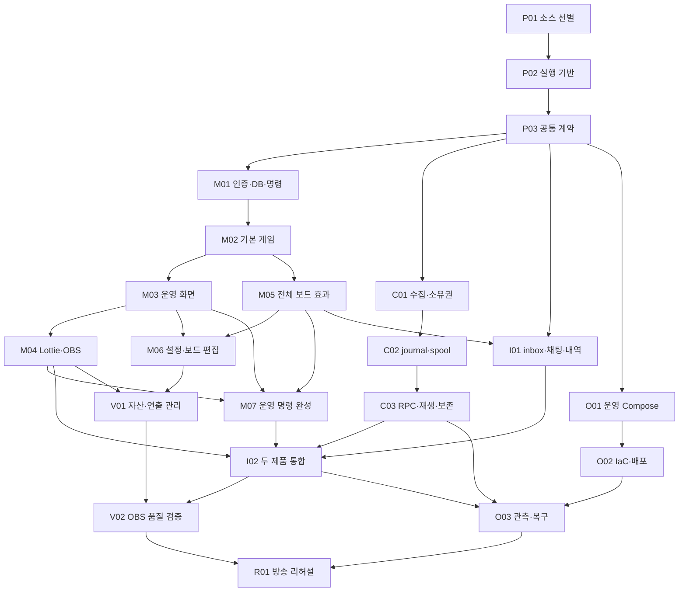

# 주루마블·로기챗 구현 계획 v1

작성: 2026-09-21. 대상: rogimarble, rogi-collector. 상태: 구현 진행 중.
현재 구현·검증 결과는 [진행 기록](implementation-status.md)을 따른다.

[최종 설계](final-design.md)를 작업 단위와 검증 순서로 나눈다. 세부 계약은
[운영 콘솔](operator-console.md), [보드](board-design.md), [설정 관리](configuration-management.md),
[소스 이식 정책](source-import-policy.md)을 따른다. 기존 조사/이식 후보는 [조사 기록](repository-review.md)에 보존했다.

## 1. 출발점과 첫 출시 범위

착수 당시 rogimarble에는 후원 판정·보드 타입/검증·좌표/경로 미리보기, 두 JSON 프리셋, 코어 테스트 26개가 있었다.
rogi-collector에는 조사/설계가 있었다. 기존 단위 테스트와 문서 작성을 서비스 구현 완료로 계산하지 않는다.
사용자 요청에 따라 웹/API/DB와 피드백용 초기 배포를 먼저 병렬 구현한다. 초기 배포는 아래 마일스톤의
통과 조건을 대체하지 않으며, 미지원 효과를 제외한 검증 보드로 확인한다.

첫 출시는 웹 규칙/보드/연출 편집, 실제 운영 콘솔의 모든 조작, 정확 개수 후원·공유 말 하나·연차·실드·
운영자/본인 채팅 선택, 모든 보드 효과, Lottie 연출, 공통 수집기, 독립 EC2 2대의 Compose/복구를 포함한다.
수동 운영 시연은 중간 산출물이다. 후원 내역이나 특수 상태 관리를 후속 출시로 미루지 않는다.
Three.js는 필요한 장면의 선택적 adapter이며 기본 Lottie 흐름을 대체하지 않는다.

술 적립 +1잔/전량 단일 미션 청산, 다음 주사위 이동 거리 ×2는 확정 요구다.
정상 이동 6면 주사위 1개와 무인도 탈출 판정 전용 2개, 청산 완료 시 차감,
청산 실드 불허 등은 설계의 편집 가능한 초기 제안값이다.
제안값과 확정 요구를 설정 도움말에서 구분하고 미정인 새 효과는 초안만 허용한다.

## 2. 순서와 마일스톤

작업 ID는 두 레포에서 공통으로 쓴다. 각 ID는 리뷰 가능한 변경 묶음이며 큰 작업은 하위 PR로 나눈다.
한 PR에 이식·전체 DB·전체 UI·배포를 함께 넣지 않는다. 선행 작업은 통합 검증된 계약을 뜻한다.
완료 날짜는 처리 속도/플랫폼 검증 전 임의로 약속하지 않고 아래 통과 조건으로 진행한다.

P03 이후 수집기 C 계열과 주루마블 M 계열은 병행 가능하다. I01은 계약 기반 합성 gRPC 서버로 시작하지만
I02는 실제 C03이 필요하다. O 계열 파일 작성/정적 검증은 병행하고 실제 배포 통과는 앱 완성 뒤 확인한다.
단독 작업 기본 순서는 P → M01~M04 → M05~M07 → C → I → V → O → R이다.

| 마일스톤 | 필요한 작업 | 검토할 결과 |
| --- | --- | --- |
| A · 재현 가능한 기반 | P01~P03 | 독립 빌드/로컬 저장소, 고정 계약, 반입 기록 |
| B · 수동 운영 시연 | M01~M04 | 로그인→세션→주사위/실드/방향/위치→DB→Lottie OBS |
| C · 방송 규칙/편집 | M05~M07 | 모든 효과, 26칸/크기/내용/동작 편집·게시, 특수 상태 조작 |
| D · 후원 연결 | C01~C03, I01~I02 | query→inbox→후원 내역/게임, 장애 뒤 재생 |
| E · 연출 품질 | V01~V02 | 자산 관리·품질 설정, 실제 OBS 30분 검증 |
| F · 운영/출시 | O01~O03, R01 및 A~E | 두 호스트 배포·복구 실측·스트리머 리허설 |

B는 지원 효과만 쓰는 별도 검증 보드로 시연한다. 미구현 특수칸을 무시하고 초기 26칸을 실게임에 게시하지 않는다.
초기 보드 전체 실행과 웹 편집 완료는 C의 통과 조건이다.

## 3. 기반 작업 — 두 레포

### P01 · 파일별 이식 준비

선행: 없음. 원본을 대상 밖에 둔 채 고정 SHA와 파일별 원본/대상/helper/수정/고지/검증 목록을 만든다.
공개 가능한 출처는 각 레포 `docs/source-imports.md`, 상세 private 조사·운영 정보는 대상 밖에 보관한다.

| 참고 | 첫 후보 | 제외/수정 |
| --- | --- | --- |
| meloming-overlay | OBS shell·재연결·revision 비교 | 음악 도메인·전체 자산 제외 |
| meloming-gateway-service | 인증·Socket.IO·Redis 소비·동기화 | 인증 전 join 수정, 위젯 접속과 게임 수집 분리 |
| meloming-back | 설정 manifest·검증·outbox 패턴 | 기존 MySQL 도메인/migration 전체 제외 |
| meloming-chat-collector | SOOP parser/connector·manager·lease·테스트 | 후원 drop/publish 실패/ID/handoff 정책 수정 |
| meloming-chat-service | private 구현 차이 비교 | private proto·운영 설정 제외 |
| rogichat / rogichat-ops | EC2/systemd/secret/digest/host lock 패턴 | Aurora·기존 운영 값·관리 EC2 제외 |

반입 허가는 개별 파일로 기록하고 의존 helper/test도 추적한다. 원본 전체 복사 후 삭제, Git 이력 연결은 금지한다.
직접 이식의 고지/허락 근거가 없으면 해당 파일은 후보로 남겨 경계와 대안을 기록한다.

통과: 반입 대상 전부가 목록/고지와 대응한다. 첫 커밋 전 staged 검사, 첫 공개 전 모든 공개 ref/커밋 검사와
비밀 검사를 준비한다. public PR에 먼저 올리고 검토하는 흐름을 사용하지 않는다.

### P02 · workspace·개발 Compose·검증 명령

선행: P01. marble apps/web, api(HTTP/worker 별도 entrypoint), gateway와 contracts/database/overlay-ui/
animation/asset-manifest 패키지를 만든다. Go는 기존 역할별 module 경계를 유지한다.

- Node/pnpm/Go/프레임워크·DB·Redis·Lottie 호환성을 확인하고 lockfile/toolchain/digest로 고정한다.
- 레포마다 `deploy/compose.yaml`, 개발 override, 비밀 없는 환경 예시와 시작/종료/상태 명령을 제공한다.
- project/volume 이름을 분리하고 개발 포트는 localhost에 제한한다. 운영 설정과 구분한다.
- root 검증 명령과 public CI에 lint/typecheck/unit/integration/build를 연결한다. 실제 존재하는 검사만 실행한다.
- 합성 fixture와 disposable DB를 쓰고 SOOP live 테스트는 기본 test/build에서 실행하지 않는다.

통과: clean checkout에서 각 레포 독립 설치/빌드·PG/Redis 준비·migration이 가능하다.
기존 코어 26개 회귀 사례를 유지하며 sibling checkout/private 의존성 없이 빌드한다.

### P03 · 공통 수집 계약과 제품 계약

선행: P02. collector proto/contracts가 공통 계약 원본이다. marble 제품 API/Command/Result/Snapshot/Cue는 별도 계약이다.

- Donation/Chat/CollectionStatus, GetCollectionStatus/SetChannelSubscription/ListDonations/WatchDonations/
  AckDonations/WatchChat을 정의한다. native 개수/종류·nullable ID/시각·같은 userId 정규화 규칙을 보존한다.
- generation+channelOffset, 64비트 문자열, ACK=소비 DB의 연속 수락 완료 구간, cursor 만료/gap·consumer/channel scope 오류를 고정한다.
- 이벤트별 identityStatus(source_id/observation_only/reconnect_ambiguous)·qualityReasons·관련 관측 ID를 계약에 추가한다.
  원천 ID 없음 자체와 근거 있는 재접속 불확실성을 구분하며 raw packet/인증정보는 전달하지 않는다.
- 관리 scope의 ResolveConsumerRecovery RPC를 추가한다. 이전/새 세대·재개 기준점·미복구 범위·멱등 키·사유를
  기록하고 재개 기준점 변경을 inbox 수락 ACK로 계산하지 않는다. 세부 재개 절차는 I02를 따른다.
- Go/TS round-trip, null·큰 offset·알 수 없는 종류·호환 필드 추가를 합성 fixture로 검증한다.
- version/source SHA/checksum/생성 도구가 있는 계약 묶음을 만든다. marble은 고정 산출물을 소비한다.
- 초기 생성 TS/schema 반입도 provenance와 checksum을 남긴다. sibling 경로를 빌드 입력으로 사용하지 않는다.
- ChannelConfig에 기존 donation config v1을 하위 설정으로 넣고 strict validator를 우회하지 않는다.

통과: 합성 query↔TS client의 계약 검증. 공통 이벤트에 sessionId/주사위/보드/채팅 명령어가 없다.
계약 산출물 공개도 P01 검사를 따른다. 실제 RPC 인증/내구성은 C03/I02에서 검증한다.

## 4. 주루마블 운영 흐름 — rogimarble

### M01 · DB·인증·버전·명령 기반

선행: P03. 고정한 제품 명령/설정 계약을 바탕으로 packages/database와 apps/api에 다음을 구현한다.

- Channel/Binding/Operator, Config/Board/AssetVersion, GameSession, OperatorCommand/OperationRecord/AuditLog,
  GameOutbox/OverlayAccess migration. 게임 모델은 후속 migration으로 확장한다.
- 일회성 bootstrap 관리자, 서버 세션, 관리자/운영자/조회 역할, 채널 소유권 승인, 쿠키/CSRF/로그인 제한.
- 멱등 키+본문 hash, sessionEpoch/대상 revision, 같은 키의 기존 결과 반환을 공통 명령 경로로 처리.
- 상태/원장/결과/outbox 원자 커밋, worker 재시도·종료·drain, 명시적인 최초 프리셋 가져오기.

통과: 실제 PG에서 두 운영자 충돌·응답 유실 재전송·같은 키/다른 본문 거부·채널 격리·권한 철회 검증.
재시작으로 사용자 설정을 덮지 않고 조회/OBS 자격으로 쓰기를 거부한다.

### M02 · 기본 게임과 수동 명령

선행: M01. 순수 전이는 game-core, 난수·잠금·저장은 api worker가 담당한다.

- 준비/실행/일시정지/한 건 진행/종료/새 세션, 공유 말, 세션 고정 보드/주사위 snapshot과 요청 수락 시 후원 규칙 snapshot 분리.
- 서버 난수·눈/경로/실행 방향 저장, action+rollIndex unique, 정/역 이동·lap·none/mission/grant_item.
- 인벤토리 증감/지정·원장, 완료/면제/실드 방어, roll/direction/position/move_steps 명령.
- 위치 보정의 일시정지+position revision+presentationEpoch barrier를 원자 처리. 홈 보드에서의 직접 이동은 도착 효과를 항상 실행하며 통과/lap 효과는 끔.
- 방향은 다음 미확정 이동부터 적용. pending/완료 결과/표시 상태를 분리하고 미완료만 재시도.

통과: crash/재전송 후 저장된 눈 재추첨·중복 지급 없음, 한 건 진행은 한 이동만 실행.
수동 명령은 operator 출처이며 후원 건수/합계에 포함되지 않는다. 개별 결과를 최신 snapshot으로 대체해 지우지 않는다.

### M03 · 실제 관리 페이지의 첫 흐름

선행: M02. apps/web `/console/channels/:channelId/live`, 로그인·세션 선택을 실제 API에 연결한다.
상단 세션/연결, 중앙 보드, 우측 주사위/방향/위치/재고, 홈 왼쪽 하단 후원 내역과 대기 작업 탭을 배치한다. 운영 기록은 개발자도구에서 확인한다.
등록 아이템마다 +/−/최종 수량, 수동 굴림/횟수, 칸/번호 보정, N칸 이동, 미션/실드 폼을 제공한다.
충돌·권한 오류·응답 유실·재연결·빈 상태·중복 제출을 처리한다. 수집 전 후원 목록은 정상 빈 상태다.

통과: 브라우저→API→DB→다른 콘솔에서 실제 값 일치, 새로고침/재시작 유지.
터미널/JSON 편집 없이 주요 조작을 수행하는 E2E 증거를 남긴다.

### M04 · Lottie·gateway·OBS 첫 연결

선행: M03. gateway 선별 이식, overlay-ui/animation의 기본 adapter와 검토된 최소 Lottie 자산을 연결한다.

- 읽기 token 검증 뒤 join, 발급/회수, snapshot/resume, sequence/revision, 회수 시 기존 socket 종료.
- fragment token 로그/analytics 제외, DOM/SVG 칸 좌표와 말 wrapper 이동 분리, Lottie 주사위/말/착지.
- prepare/play/cancel/finishImmediately/dispose, timeout/정적 fallback, cue 중복 방지·barrier 취소.
- 최신 서버 상태와 재생 위치 분리, 표시 ACK는 관측용, 자산/WASM 자체 제공.

통과: 실제 Lottie 이동을 시연한다. OBS 0/1/2개에서 게임 결과 동일, 위치 보정 뒤 늦은 callback 무효.
기본 게임을 Lottie 완료에 묶지 않는다. 자산/연출 편집은 V01에서 완성한다.

### M05 · 모든 typed 효과와 차례

선행: M02. BoardEffect의 모든 게시 가능한 종류에 handler registry·상태·회귀 테스트를 연결한다.

- choice_mission, 추가 이동/도착·통과, 방향전환, lock/modifier의 모든 variant, counter_add/settle.
- root/parent/방문 순번별 EffectExecution unique와 단계/거리/시간 상한, 재시작 후 미처리 효과 재개.
- 청산 총량/예약량/가용량·미션 수량 snapshot. 3잔은 미션 하나, 이후 적립 보존, 완료/방어/면제와 취소 반환 구분.
- creation/mission_completion 모두 검증. ×2는 다음 실제 주사위 이동 한 회, repeat_roll 재귀 금지·적용 순서 고정.
- 무인도 3회 실패 뒤 다음 차례, 더블 합계 이동, 판정 중 modifier 보존/소모와 수동 제한 해제.
- 세계여행 차례 예약·선입력·원인 후원자의 선택권·만료/취소 시 같은 미실행 차례 반환.
- 목적지/미션 barrier와 무인도 보류 직접 이동을 구분해, 뒤의 탈출 판정까지 막히는 교착 방지.

통과: [보드 계약](board-design.md)의 모든 variant 성공/거부/동시성/crash 복구 검증.
미지원 handler/unconfigured 게시·세션 시작 거부. 무한 연쇄는 마지막 기록 상태에서 운영자 확인으로 전환.

### M06 · 설정/보드 편집·게시

선행: M03, M05. schema 기반 폼과 격리 preview session을 만든다.

- 후원 규칙 CRUD/활성화/정확 개수/연차 매핑/아이템·실드/채팅 입력 방식.
- 26칸 프리셋 가져오기, canvas와 행·열 구분, grid/freeform, stable cellId/path 재배치.
- 문구/색/모양/이미지·Lottie, onLand/onPass type/매개변수/순서, 중앙 widget, 주사위 설정.
- 삭제 칸의 start/path/목적지 참조 수정. 9×6→10×6은 기존 26개 ID 보존하며 28칸 배치.
- 초안/검증/미리보기/게시, revision 충돌, 참조/소유권/handler 지원/순환 위험 검사.
- 보드는 새 세션, 후원 규칙은 새 수락 요청부터 적용. JSON import/export는 보조 기능.

통과: 웹에서 33→34, 문구/동작·실드 정책·배수/횟수·해제 조건·크기/칸/위젯을 재배포 없이 수정/저장.
같은 세션에서 게시 전 수락한 요청은 기존 후원 규칙, 게시 후 새 요청은 새 규칙으로 실행한다.
보드/주사위 snapshot은 현재 세션에 유지하고 새 세션에서 새 보드와 초기 26칸 전체 효과를 검증한다.

### M07 · 운영 명령과 감사 완성

선행: M03, M05, M04. API/폼 작업은 M03/M05 뒤 시작할 수 있지만 verified는 M04의 OBS 통합 뒤 가능하다.
운영 콘솔 명세의 전체 명령을 폼→API 연결표로 추적한다.
적립 증감/총량 지정·청산/취소, modifier 부여/수정/해제, lock 잔여/조건/해제, 여행 예약을 제공한다.
목적지 선택·취소, lap, 보류/재개/취소/미완료 재시도·허용 순서 조정, 종료/명시적 이월도 구현한다.
기록 검색·전후 값/사유·원인 연결, 후속 변경 없는 보정의 되돌리기를 제공한다.
연출 건너뛰기/재동기화/별도 재표시는 표시 명령으로 구분하고 M04 후 OBS까지 검증한다.

통과: 예약량 이하로 적립 덮기 거부, 방어/완료 한 번 처리, 위치 보정 후 대기/특수 상태 보존,
중복·무권한 조작 거부. 후원에 의존하지 않는 운영 콘솔 인수 시나리오 전부 통과.

## 5. 수집·연동 — 두 레포

상세 수집기 계획은 rogi-collector의 `docs/implementation-plan.md`에서 같은 ID로 관리한다.

| ID / 선행 | collector 범위 | 통과 조건 |
| --- | --- | --- |
| C01 / P03 | SOOP connector·등록 채널·구독/opt-out·lease/fencing·최근 chat | 미설정 0채널, 두 제품 구독 격리, stale owner 거부·합성 연결 복구 |
| C02 / C01 | native 후원/ID·journal+outbox·counter 잠금·bounded spool | 정상 동일 후원 2건, 저장 경계 crash 동일 ID, DB/Redis/용량 장애 노출 |
| C03 / C02 | mTLS query·List/Watch/ACK·chat gap·소비자 cursor·보존 | replay/live 무누락, ACK 유실, 늦은 커밋, 타 consumer/channel 거부 |

일반 채팅 drop 정책을 후원에 적용하지 않는다. 원천 ID 없는 reconnect 중복은 불확실성을 남기고
raw hash 단독 삭제를 하지 않는다. 실제 플랫폼 호환성은 R01에서 별도로 확인한다.

### I01 · inbox·판정·채팅 선택·내역 API — rogimarble

선행: P03, M05. 계약 기반 합성 query와 실제 PG로 시작한다.

- consumer/channel/generation별 수락을 직렬화하고 inbox+연속 수락 cursor를 같은 PG 트랜잭션으로 저장한 뒤 ACK한다.
  재접속 stream마다 소비 lease epoch를 두어 오래된 stream의 저장/ACK를 차단한다. 높은 offset 한 건이 먼저
  완료되었다는 이유로 cursor를 앞당기지 않는다. 게임은 별도 영속 processor로 실행한다.
- 수락 시 세션/규칙 snapshot, 세션 없음·지연/복원 불명확·미확인 후원 종류를 분류한다.
- reconnect_ambiguous와 그 근거도 inbox에 저장·ACK하되 게임 적용은 검토 상태로 보류한다.
  검토 승인/무동작 마감은 동일 action의 멱등 명령이며, 정상 동일 후원 두 건을 의심만으로 병합하지 않는다.
- 66/99/200/250도 기록. 설정 변경으로 과거 미일치 자동 재판정 금지.
- 정확 개수·연차 index·미션/실드/목적지를 기존 명령 서비스에 연결.
- userId/채널/세션/요청/칸 검증, 채팅/후원 역순 후보 유예, 웹·채팅 경합/만료/다중 요청/donor 부재 처리.
- 후원 목록/상세 cursor·필터·동일 조건 서버 합계·상태/무동작 사유·보정 원인 연결.

통과: inbox commit/ACK/결과 확정 경계 crash에 중복 효과·재추첨 없음.
낮은 offset 저장 실패·높은 offset 선처리 시도·겹친 재접속 stream에서도 ACK가 미수락 구간을 넘지 않는다.
정상 동일 후원 두 건은 모두 처리하며 재접속 의심 관측은 승인/무동작 마감 전 자동 실행하지 않는다.
타인/같은 닉네임/과거 메시지/재전송이 잘못된 목적지를 확정하지 않는다.

### I02 · 두 제품 통합과 후원 운영 페이지

선행: C03, I01, M07, M04. 독립 Compose 프로젝트를 mTLS로 연결한다.
수집 승인/시작/중지·지연 표시, 내역 검색/필터/합계/상세·재시도/보정·검토 마감을 UI에 연결한다.
실제 서비스에는 합성 adapter 입력으로 자동 검증한다. 실후원을 만들지 않고 전달/게임 통합을 검사한다.
collector 정지 중 수동 운영, marble 정지 중 수집, 재연결 후 journal 재생을 검증한다.

cursor 만료/세대 불일치는 다음 운영 복구 절차까지 구현한다.

1. 해당 소비 채널을 복구 필요 상태로 멈추고 기존 cursor·신규 earliest/current·미복구 범위를 조회한다.
2. 운영자가 웹에서 기록을 대조하고 보존된 최초 지점 재생 또는 명시적인 구간 포기와 재개점을 확정한다.
3. 기존/새 generation·기준점·미복구 범위·사유·작업자·멱등 키·expectedRevision을 복구 원장에 저장한다.
4. 관리 권한으로 ResolveConsumerRecovery를 호출한다. collector는 유효한 세대/범위의 기준점인지 검증하고
   consumer별 recovery revision과 결정을 저장한다. 이 기준점은 수신 완료 ACK가 아니다.
5. marble은 요청됨→collector 반영됨→로컬 반영됨을 영속 기록한다. RPC 응답 유실은 같은 키로 조회/재시도하고
   양쪽 확인 전 수신을 재개하지 않는다. 기존 inbox/결과는 삭제하지 않으며 옛 stream epoch는 무효화한다.
6. 새 기준점 이후 연속 수락 cursor에서 ACK를 다시 시작한다. 복원 이전 실제 방송 실행 여부가 불확실하면
   게임 자동 적용은 별도 검토가 끝날 때까지 보류한다.

이는 아직 못 받은 구간의 복구 결정이며 개별 후원 검토 명령과 구분한다. DB 직접 편집으로 cursor를 초기화하지 않는다.
웹 복구는 운영 콘솔 명세의 collection-recovery 조회/resolve API와 commandId 조회로 연결한다.
채널/consumer 범위 명령이므로 활성 게임 세션 없이도 실행하고 게임 세션을 임의로 생성하지 않는다.

통과: 7개 규칙/미일치 입력→journal→inbox→결과→OBS/운영 기록 추적.
두 콘솔/OBS·중복/역순·부분 연차·cursor 만료에서 원장 일치. 만료/세대 변경→웹 재개점 확정→정상 수신까지 검증한다. 실제 SOOP 관측과 합성 통합을 구분한다.

## 6. 연출 완성과 운영

### V01 · 자산/연출 편집 — rogimarble

선행: M04, M06. 업로드·자산/연출 버전·폼을 구현한다.
출처/작성자/고지/checksum/marker/fallback을 기록하고 번들/업로드를 구분한다.
파일/압축/프레임/레이어/외부 URL·폰트·이미지/state machine을 검증하고 격리 smoke/미리보기 후 게시한다.
이벤트별 매핑, 속도/길이/색/크기/효과음·DPR·동시 효과·저사양/연출 끄기를 제공한다.
assetVersion 고정·preload·dispose·이전 버전 복원·업로드 영속 volume을 연결한다.
필요한 3D 장면이 정해지면 같은 adapter의 lazy Three.js를 추가한다.

통과: 자산 실패/외부 참조 거부/게시 중 재생에서 결과 유지, 외부 CDN/API가 없어도 필수 연출 가능.
3D 도입이 필수 Lottie 흐름의 완료를 늦추지 않는다.

### V02 · 실제 OBS 검증 — rogimarble

선행: I02, V01. 지원 OBS/OS/GPU와 품질 preset을 기록한다.
후원→주사위→눈→경로→착지→미션, 서버/재생 상태 분리, 연속 입력을 검증한다.
중복/gap/session·board·asset mismatch·숨김/복귀·단절·timeout·WebGL context loss를 주입한다.
재접속 재생 상한(초기 10개 또는 15초), snapshot 압축·barrier·별도 재표시를 확인한다.
1080p/60fps 30분, 프레임 간격 p95 20ms 목표와 OBS 지연/메모리를 측정한다.
720p/30fps·reduced motion·정적 fallback도 확인한다.

통과: 지원 장비의 품질 목표 또는 명시한 저사양 지원 기준 달성, 자원 누수/누적 없음.
목표 미달은 효과/동시성/해상도를 조정하고 재측정한다. 브라우저 E2E만으로 OBS 검증을 대체하지 않는다.

### O01 · 이미지·운영 Compose — 두 레포

선행: P03. 파일/정적 검증은 병행 가능, 통과에는 실제 앱/수집기가 필요하다.
Dockerfile·신뢰된 release 빌드, SHA/digest/Compose hash/migration checksum/계약 version manifest를 만든다.
각 제품 독립 PG/Redis·일회성 migration·data/spool/자산·health/자원/로그 제한을 구성한다.
dev build/port와 production digest/secret을 분리하고 운영 DB/Redis/API host port를 미공개한다.
public PR CI에는 cloud/SSH 권한을 주지 않고 릴리스 발행 권한과 분리한다.
역할별 secret 파일·DB 계정 mount 표를 작성한다. 앱에는 자신의 필수 secret만, 초기화/migration 계정은
해당 one-shot에만 제공하며 공용 secret 디렉터리 전체를 앱에 mount하지 않는다.

통과: 비밀 없는 예시의 compose config·실제 이미지 기동, 변조 digest/manifest·계약 불일치 사전 거부.

### O02 · IaC·한 번의 배포 — 두 레포

선행: O01. marble network root, marble EC2 root, collector EC2 root의 state/소유 자원을 분리한다.
network→A SG/host→B SG/host 순서, B endpoint는 A runtime 입력으로 주어 root 순환을 피한다.
EC2 총 2대·독립 암호화 EBS·IMDSv2·SSM·최소 IAM·A 80/443·private 7443 mTLS·public SSH 미개방을 검증한다.
EC2 교체와 data EBS lifecycle을 분리하고 데이터 볼륨 삭제/교체를 IaC 및 배포 도구에서 차단한다.
삭제 보호 해제는 백업·복구 확인과 대상/영향을 기록한 명시적 유지보수 절차로만 허용한다.
앱 컨테이너의 metadata 접근은 Docker forwarding 경계에서 차단하며 IMDSv2 설정만으로 격리됐다고 보지 않는다.
backend/plan/실제 값/키는 Git 밖에 두고 secret 값은 state/user_data/image에 넣지 않는다.
mount/UUID→Docker/network→tmpfs secret→저장소→migration→앱 순서의 역할별 systemd unit, Compose restart=no를 적용한다.
각 unit은 담당 컨테이너 종료를 실제로 감지해 재시작한다. detached compose up의 성공을 지속 감독으로 취급하지 않는다.
health/heartbeat만 실패한 hang은 제한된 재시도/알림 정책으로 별도 처리하며 무한 재시작을 숨기지 않는다.
`tools/ops/deploy.sh --manifest ...`가 host lock·검증·drain·readiness·migration·기동·smoke를 수행한다.
호환 이전 이미지 rollback, migration 실패 차단, data EBS 부재 차단을 구현하고 down -v/down migration은 자동 실행하지 않는다.
Tailscale/OpenSSH host key pin/공개키 reconcile·SSM 복구·mTLS 만료 관측/회전을 검증한다.

통과: 대상 환경 cold boot·동시 배포·migration 실패·rollback·인증서 교체 증거.
EC2 교체 후 기존 data EBS 재연결로 DB/spool/자산 보존, 삭제/교체 plan 차단을 검증한다.
앱 내부에서 metadata·타 역할 secret·migration 계정 접근이 실패하는지 실제 컨테이너로 검사한다.
각 장기 실행 프로세스를 강제 종료해 mount/secret 순서를 유지하며 복구되고 정상 작업을 재개하는지 검증한다.
AWS 생성/DNS/실방송 연결은 구체적인 plan·비용·삭제 영향·manifest를 먼저 검토 가능하게 준비한다.
계획 작성 자체가 해당 실행이나 기존 rogichat 운영 변경을 뜻하지 않는다.

### O03 · 관측·보존·백업/복구 — 두 레포

선행: O02, C03, I02. 서비스별 지표는 앞 작업부터 추가하고 운영 절차로 통합한다.
수집 gap/lease/spool·journal/ACK/inbox/outbox 지연·게임 큐·worker 진행·DB/디스크/인증서/백업을 관측한다.
30일 후원/게임, 채팅 24시간 및 10,000건, spool 1GiB는 변경 가능한 초기값이다.
최소 보존+활성 ACK와 최대 용량/기간을 함께 검사하며 보존 축소/강제 만료를 드러낸다.
각 PG의 pgBackRest base backup+WAL, 업로드 자산/manifest/복구 메타데이터를 자신의 S3 prefix에 백업한다.
복원 후 generation·cursor/inbox/result/원장 대조 전 자동 worker를 시작하지 않는다.
marble만 과거 복원 시 이미 방송에서 수행한 후원을 자동 재실행하지 않고 검토/대조한다.
월간 격리 복구 runbook을 작성하며 상시 세 번째 EC2는 만들지 않는다.

통과: 제품별/서로 다른 시점 DB 복원 실측, 목표 RPO 5분/RTO 2시간 달성 여부 기록.
플랫폼 미수신/영속 수락 전/보존 밖의 복구 한계를 명시한다. EBS snapshot만으로 PG 백업 완료를 주장하지 않는다.

### R01 · 실제 채널 관측·방송 리허설 — 두 레포

선행: 다른 마일스톤 전체. 승인된 채널/입력/관측 범위를 준비하고 실행한다.
SOOP 원천 ID/종류/native 개수·방송 전환/재접속 의미를 확인하고 민감 값 없는 fixture를 보강한다.
스트리머가 웹으로 룰/보드/연출 변경·후원 조회·모든 수동 조작·장애 복구를 수행한다.
실제 금전 후원은 자동 생성하지 않는다. 필요한 테스트 방법/범위와 결과는 합성 테스트와 구분한다.
release source/digest/계약·적용 설정/보드/자산·검증 환경·남은 제한·rollback 경로를 남긴다.

통과: 필수 기능 누락과 중복/유실을 숨기는 결함 없음, 웹만으로 운영 가능.
실플랫폼 미관측 항목은 미검증으로 표시하며 출시 완료로 올리지 않는다.

## 7. 요구사항·검증 추적

| 요구/경계 | 작업 | 필수 증거 |
| --- | --- | --- |
| 재사용·private 전체/이력 제외 | P01, 모든 반입 | 파일 목록/고지·공개 ref/비밀 검사 |
| 정확 개수·연차·7개 규칙·33→34 | M06, I01, I02 | core+DB/API+웹 편집 후 적용 |
| 공유 말·수동 굴림·방향/위치·재고 | M02~M04, M07 | 실제 UI/DB·재시작·두 콘솔/OBS·barrier |
| 판 크기/칸 수/내용/typed 동작·widget | M05, M06 | 26칸 재현·28칸 변경·freeform·참조 보존 |
| 적립/청산·×2·무인도·여행 | M05, M07 | 상태 전이·동시성·예약/취소·crash |
| 실드 정책·전체 보상·미션 | M02, M06, M07, I02 | 잔량 부족/완료 경합·예약량 보존 |
| 내역/검색/합계·재시도/보정 | I01, I02 | 미일치 포함·동일 필터 집계·원인 연결 |
| 웹/본인 채팅 선택 | M05, M07, I01, I02 | 역순·타인·만료·동시 확정 한 번 |
| 등록 채널·공통 제품 경계 | P03, C01, C03 | 두 consumer·opt-out·읽기/관리 scope |
| 후원 내구성·cursor/gap | C02, C03, I01, I02 | commit/ACK/crash·정상 동일 후원 2건 |
| Lottie·선택적 Three·인터랙션 | M04, V01, V02 | 실제 OBS 영상/측정·fallback |
| 인증·채널 격리·OBS 읽기 | M01, M04, I02 | 권한/토큰 회수·CSRF·타 채널 거부 |
| EC2 2대·Compose 한 번 기동 | O01, O02 | plan·cold boot·mount/secret/migration 차단 |
| 보존/관측/복구 | C03, O03 | cursor 만료·WAL·복구 실측·재실행 차단 |

DB 통합은 실제 PG, 웹 E2E는 실제 테스트 API/DB를 사용한다. 합성 SOOP 입력과 live 관측을 구분한다.
검증 기록에는 환경·명령·결과·한계를 남긴다. mocked UI만으로 기능 완료를 표시하지 않는다.

## 8. 진행 관리와 첫 착수

상태는 todo→doing→review→verified다. verified에는 해당 검증 증거·호환성/migration·출처/문서 갱신이 필요하다.
첫 작업은 P01→P02→P03, 이후 M01→M04의 실제 수동 운영 시연이다.
P03 뒤 병행 시 collector proto/contracts 소유자를 정하고 고정 버전 생성물만 소비 레포에 반영한다.
DB schema/명령 계약도 소유 경계를 정해 병렬 변경 충돌을 피한다.

추가 플랫폼·다중 호스트·상시 QA/관리 서버·전체 채팅 archive·새 금융/재산 규칙을 첫 출시 의존성에 넣지 않는다.
서브 에이전트 검토와 반영 내역은 [계획 리뷰 기록](implementation-plan-review.md)에 남긴다.
