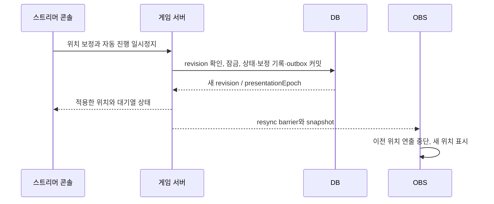

# 스트리머 운영 콘솔 설계

작성: 2026-09-21. [최종 설계](final-design.md)의 방송 운영 기능을 구체화한 필수 구현 명세다.
**화면·API·DB·수동 명령은 아직 구현 전**이다. 이 문서를 실제 동작하는 페이지로 구현해야 출시할 수 있다.

## 1. 첫 출시에서 제공할 운영 범위

스트리머가 웹 관리 페이지에서 후원을 확인하고 실드 등 보상 수량, 주사위, 말의 방향·위치,
미션과 대기열, 게임 세션을 직접 제어한다. 방송 중 작업을 위해 개발자·터미널·DB 직접 수정이 필요해서는 안 된다.
설정 편집, 운영 중 조작, 미리보기를 구분하고 현재 어느 세션에 영향을 주는지 항상 표시한다.

| 기능 | 화면에서 제공할 조작 | 실제 적용 |
| --- | --- | --- |
| 후원 내역 | 실시간 목록·검색·필터·상세, 처리 결과/무동작 사유 확인 | 수집한 후원과 게임 요청·결과·보정 이력 연결 |
| 실드 등 보상 | 아이템별 추가·차감·최종 수량 직접 지정, 변경 이력 | 현재 공유 세션 인벤토리에 영속 반영 |
| 적립·특수 상태 | 적립 수량 증감/지정·청산/취소, 배수/횟수 조정·해제, 이동 제한 조정·해제, 여행 예약 관리 | 현재 상태·예약 수량·원인을 저장하고 재시작 시 복구 |
| 수동 주사위 | 1회 굴리기, 횟수 입력, 대기열 위치 확인 | 서버 난수로 실제 게임 진행; 후원 없이 실행 가능 |
| 진행 방향 | 정방향/역방향 선택, 현재 방향 표시 | 다음 아직 확정되지 않은 이동부터 적용 |
| 말 위치 | 보드의 칸 선택 또는 칸 번호 입력, 현재/목표 미리보기, 적용 | 공유 말의 실제 위치 보정, OBS 동기화 |
| 칸 수 이동 | N칸 이동, 현재 방향 또는 정/역방향 선택 | 경로를 따라 이동하고 지정한 칸 효과 정책 적용 |
| 미션·실드 사용 | 완료·면제·실드 사용, 대상 미션 선택 | 미션과 재고를 함께 확정 |
| 원하는 칸 요청 | 후원자의 대기 요청 선택·목적지 확정·취소 | 채팅 입력과 같은 요청을 한 번만 처리 |
| 대기열 | 요청별 보류·재개·취소·미완료 작업 재시도 | 수락된 요청을 보존하며 실행 제어 |
| 게임 | 준비·시작·일시정지·한 건 진행·재개·종료·새 세션 | 현재 세션/후원 처리 상태를 명시적으로 전환 |
| 화면 복구 | 현재 연출 건너뛰기·OBS 재동기화·연출 다시 보기 | 저장된 게임 결과를 재실행하지 않고 표현만 조작 |
| 수집 복구 | 재생 가능/미복구 범위 확인·재개점 확정·복구 상태 조회 | 관리 권한·멱등 명령으로 복구 원장 기록 후 정상 수신 재개 |
| 운영 이력 | 작업자·시각·전후 값·사유·원인 조회, 가능한 보정 되돌리기 | 모든 상태 변경을 추적 가능한 명령으로 기록 |

스트리머 계정은 자신의 채널에서 위 모든 기능을 사용할 수 있다. 위임받은 운영자는 부여된
조회·게임 진행·보상 조정·위치/방향 보정·설정 관리 권한으로 작업한다. 조회 전용 계정과 OBS token은
읽기만 가능하다. 권한은 버튼뿐 아니라 API와 실행 시점에서 검증한다.

## 2. 페이지 구성과 사용 흐름

기본 진입 페이지는 `/console/channels/:channelId/live`로 잡는다. 로그인하면 마지막 사용 채널의
운영 화면을 열고, 다른 방송/테스트 세션을 혼동하지 않게 채널명·세션·실제/미리보기 표식을 고정 표시한다.

| 영역 | 내용 | 자주 쓰는 조작 |
| --- | --- | --- |
| 상단 고정 바 | 채널/세션, 실행·일시정지, 수집/OBS 연결, 미처리 후원 수 | 시작, 일시정지, 한 건 진행, 재개 |
| 중앙 보드 | 서버 위치, OBS 표시 중 위치, 방향 화살표, 칸 이름·선택 표시 | 칸 클릭 → 위치 변경 패널, 원하는 칸 요청 처리 |
| 우측 조작 패널 | 주사위, 방향, 위치/칸 수, 실드·아이템·적립 카드, 배수/무인도 상태 | 굴리기, 방향 설정, 수량 +/−/직접 입력 |
| 하단 후원 패널 | 최신 후원과 처리 상태, 검색/필터, 선택 행의 상세 | 원인 확인, 연결된 미션/이동/결과로 이동 |
| 대기 작업 탭 | 이동·미션·목적지·여행 예약·정산 요청, 연차 진행도, 보류 사유 | 완료, 실드 사용, 확정, 보류/취소 |
| 운영 기록 탭 | 수동 조작·설정 변경·실패·보정 이력 | 변경 전후 비교, 연결된 원본 보기 |

데스크톱에서는 보드·조작 패널·최근 후원을 함께 볼 수 있게 한다. 좁은 화면에서는 탭으로 전환하되
상태 바와 일시정지 버튼은 유지한다. 후원 전체 내역은 별도 `/donations` 페이지에서도 조회할 수 있다.
상세는 현재 보드와 대기열을 잃지 않는 옆 패널로 연다. 규칙/보드/연출 설정은 별도 설정 화면으로 둔다.

방송 중 많이 쓰는 1회 굴리기·보상 1개 추가는 한 번의 클릭으로 요청한다. 제출 중 중복 클릭을 막고
완료/거부/대기 상태를 해당 조작 옆에 표시한다. 매번 긴 사유 입력이나 확인 팝업을 요구하지 않는다.
수량 덮어쓰기·위치 보정은 패널에서 전후 값과 적용 효과를 보여준 뒤 적용하고, 세션 종료·대기열 일괄 취소는
영향받는 요청 수를 보여준다. 작업 사유는 선택 가능한 항목을 기본으로 하며 메모를 추가할 수 있다.

연결이 끊기면 마지막 값과 마지막 갱신 시각을 표시하고 상태 변경 버튼을 잠근다.
서버 응답을 받기 전 재고/위치를 확정된 것처럼 바꾸지 않는다. 응답 유실 시 동일 명령의 상태를 조회하고,
페이지 새로고침이 새 주사위 요청을 생성해서는 안 된다. 빈 목록·조회 실패·수집 단절은 서로 다른 상태다.

## 3. 후원 내역과 처리 상세

### 3.1 목록과 검색

규칙에 맞지 않아 게임이 움직이지 않은 후원도 표시한다. 수집기가 지원하여 영속 수락한 채널 후원을
대상으로 하며 SOOP의 전체 결제 장부나 미수신 내역까지 보유한다고 표현하지 않는다.
세션 없는 시간에 수신한 후원은 채널 내역에 남기고, 현재 게임의 후원으로 소급 배정하지 않는다.

| 목록/상세 항목 | 표시 내용 |
| --- | --- |
| 발생/수신 시각 | 원천 시각과 서비스 수신 시각 구분; 원천 미제공은 그대로 표시 |
| 후원자 | 표시 이름, 인증된 플랫폼 사용자 식별에 필요한 정보 |
| 후원 사실 | native 별풍선 개수, 후원 종류, 메시지, eventId |
| 매칭 | 적용한 규칙 이름·버전·동작, 미등록/비활성/대상 외 종류 등 무동작 사유 |
| 진행 | 대기·보류·입력 대기·처리 중·부분 완료·완료·취소·실패·검토 필요 |
| 결과 | 주사위 눈·연차 index·경로·도착 칸·미션·보상 증감 |
| 연출 | 전달/표시 관측·재동기화 상태. 관측 불가도 표시 |
| 운영 대응 | 보류/취소/재시도/추가 보정, 작업자·시각·전후 값·사유 |

기간·세션·후원자·개수·규칙·처리 상태로 필터하고 서버 cursor로 페이지를 읽는다.
동일 이름의 후원자도 ID로 구별하며 동일 eventId의 재전송을 새 후원 행으로 추가하지 않는다.
필터를 적용한 총 건수/별풍선 합계는 화면에 로드된 일부 행이 아닌 같은 조건의 서버 집계를 사용한다.
합계는 후원 종류를 구분하고 운영자 조작·미리보기·추가 보상을 포함하지 않는다.
실시간 새 행이 검색 중인 목록의 위치를 밀지 않도록 새 내역 알림/자동 스크롤 전환을 제공한다.
보존 기간 밖의 내역은 조회 가능 범위를 알려준다.

### 3.2 운영 대응의 의미

- **미완료 작업 재시도:** 실패한 같은 action/roll index를 다시 진행한다. 이미 저장된 주사위나
  완료된 아이템 지급은 다시 실행하지 않는다. 부분 완료된 연차는 남은 index만 진행한다.
- **요청 보류/취소:** 아직 실행되지 않은 요청 또는 연차의 남은 부분만 대상으로 한다.
  원본 후원 행과 완료된 결과는 보존하며, 취소는 플랫폼 환불을 뜻하지 않는다.
- **연출 다시 보기:** 저장된 결과를 콘솔 미리보기에서 재생한다. 별도로 OBS 재표시를 선택해도
  신규 게임 요청·아이템 지급·이동을 생성하지 않는다.
- **추가 보정:** 운영자가 보상/이동/주사위를 새 명령으로 실행하면서 원본 후원에 연결한다.
  완료된 후원을 다시 미처리로 바꾸거나 원본 개수·후원자 정보를 수정하지 않는다.
- **검토 필요 처리:** 검토 사유와 당시 세션/규칙을 확인해 처리 가능한 기존 요청을 명시적으로 승인하거나
  무동작으로 마감한다. 종료된 세션의 후원을 현재 세션에 자동 실행하지 않는다.

미등록 200/250개는 내역에서 확인할 수 있지만 기본 상태는 계속 `일치하는 규칙 없음`이다.
규칙을 나중에 추가하거나 재시도 버튼을 눌렀다는 이유로 현재 규칙으로 다시 판정하지 않는다.
운영자가 특별히 보상한다면 `추가 보정`으로 따로 기록한다.

### 3.3 수집 중복 의심과 재생 범위 복구

재접속 불확실 관측은 내역에 근거와 검토 대기를 표시한다. 영속 수락은 끝났지만 게임 자동 실행은 보류한다.
운영자는 기존 후원/결과와 비교해 승인 또는 무동작 마감하며 동일 후원을 임의로 합치거나 지우지 않는다.

cursor 만료/collector 복원은 개별 후원 검토와 다른 수집 복구 패널로 제공한다.
미복구 시간/범위·다시 받을 수 있는 범위·게임 보류 상태를 보여주고 관리 권한자가 재개점을 확정한다.
진행 상태는 복구 필요→대조→서버 반영 중→재개로 표시한다. 세부 generation/cursor는 진단 상세에 둔다.
`resolve_collection_recovery` 명령이 작업자·사유·전후 기준점·미복구 범위·멱등 키를 기록하고 collector의
ResolveConsumerRecovery 및 로컬 cursor 반영을 조정한다. ACK/후원 처리 완료와 혼동하지 않는다.
네트워크 실패는 같은 명령으로 이어서 처리하며 중간 상태에서 worker를 자동 재개하지 않는다.

## 4. 실드·보상 수량 조정

현재 세션의 아이템 카드를 설정 데이터에서 생성한다. 실드 외에 추가한 보상도 같은 화면·API를 사용한다.
카드에는 이름·현재 수량·마지막 변경 시각·사용 가능한 미션과 증감/직접 입력을 표시한다.

| 조작 | 예 | 처리 |
| --- | --- | --- |
| 추가 | 실드 2개 → +3개 → 5개 | 양의 delta 기록 |
| 차감 | 실드 5개 → −2개 → 3개 | 잔량 검증 후 음의 delta 기록 |
| 수량 지정 | 실드 3개 → 최종 7개 | 재고 revision 확인 후 차이 +4를 원장에 기록 |
| 미션 방어 | 지정 미션에 실드 1개 사용 | 정책·미션 상태·재고를 함께 검증하고 차감 |

수량은 설정한 상한 내의 0 이상 안전한 정수로 검증한다. 음수·소수·상한 초과를 거부하고
과도한 차감을 0으로 몰래 보정하지 않는다. `차감` 자체로 미션이 방어되지 않으며 `실드 사용`은 별도 동작이다.
운영자가 미션을 실드 없이 없애려면 `면제`로 처리해 실드 정책을 바꾼 것처럼 보이지 않게 한다.

추가/차감/지정은 원장의 `before`, `delta`, `after`, itemId, sessionId, operatorId, reason,
commandId, relatedDonationId/missionId를 남긴다. 하나의 트랜잭션에서 잔량·원장·알림을 함께 갱신한다.
입력 중 후원 지급이나 실드 사용으로 재고가 바뀌면 revision 충돌을 표시하고 최신 수량으로 다시 확인한다.
새로고침·서버 재시작 후에도 수량이 유지된다. 게임 중 아이템 정의를 삭제해 잔량·미완료 미션을
고아 데이터로 만들지 않으며 필요하면 비활성화하고 참조를 보존한다.

### 4.1 술 적립·정산과 특수 상태

아이템 재고와 술 적립은 다른 원장으로 관리한다. 술 적립 카드에는 총 적립량·청산 예약량·사용 가능한 수량을
따로 표시한다. 예를 들어 총 4잔 중 청산 대기 3잔이면 사용 가능은 1잔이다. 기본값과 현재 값을 분리한다.

| 대상 | 표시 | 조작과 서버 계약 |
| --- | --- | --- |
| 술 적립 | counter 이름/단위, 총량·예약량·사용 가능량, 증감 원인 | +/−/최종 총량 지정. 예약량 아래로 덮어쓰기 거부; 예약 취소부터 안내 |
| 술 청산 | snapshot 잔 수·연결 미션·완료/방어/면제/취소 상태 | 수동 청산으로 사용 가능 전량을 단일 미션으로 예약; 완료/방어/면제는 예약량 차감, 취소는 반환 |
| 다음 이동 배수 | 배수·남은 적용 횟수·원인 칸/action | 배수/남은 횟수 지정, 즉시 해제. 기존 효과 갱신과 신규 부여를 구분하고 동일 종류를 몰래 곱하지 않음 |
| 기타 주사위 효과 | dice_count/repeat_roll의 매개변수·횟수 | 지원 타입의 입력 폼으로 부여/갱신/해제; 실제 결과 확정 후 소급 변경 금지 |
| 무인도 등 이동 제한 | 해제 조건, 남은 휴식 횟수·시도한 눈, 보류된 직접 이동 | 잔여 횟수/해제 조건 조정·즉시 해제. 현재 보드 주사위와 호환되는 값만 허용 |
| 세계여행 예약 | 원인 도착·선택권자·목적지·차례 대기/입력 대기/실행 상태 | 목적지 지정·변경(이동 확정 전)·취소. 다음 차례 전에는 이동하지 않음 |

적립량 조정은 이미 생성한 정산 미션의 수량을 몰래 변경하지 않는다. 잘못 예약한 정산은 취소한 뒤
필요한 수량을 보정하고 다시 청산한다. 원본 정산과 취소/새 정산 연결을 보관한다.
실드를 허용한 청산 미션을 방어하면 지정 실드 비용과 예약된 적립량을 같은 트랜잭션에서 정산한다.
예약량 3잔의 청산 중 새로 1잔이 적립되어도 완료 후 1잔이 남으며 재전송으로 추가 차감하지 않는다.

모든 상태 조작은 대상 revision·sessionEpoch·권한·사유와 원장/이력을 남긴다.
수동 위치 변경 패널에서 이동 제한 유지/해제를 명시하고 기본은 유지한다. 위치 변경만으로 배수·여행 예약·
적립/정산을 지우지 않는다. 세션 종료 시 대기 정산/여행을 어떻게 닫을지 보여주고 다음 세션으로 몰래 이월하지 않는다.

## 5. 주사위·방향·위치 제어

### 5.1 수동 주사위

`주사위 1회`와 `횟수 입력`을 제공한다. 현재 세션의 주사위/보드 규칙으로 서버가 결과를 결정하고
후원에 의한 이동과 같은 결과 저장·칸 효과·Lottie/Three 연출 경로를 이용한다.
source는 `operator`다. 가상의 33개 후원이나 가짜 후원자를 만들지 않는다.
수동 횟수는 별도 서버 상한을 따르며 후원 연차 활성/비활성과 혼동하지 않는다.

실행 중에는 기본적으로 이동 대기열 끝에 넣고 예상 순서를 보여준다.
일시정지 상태의 수동 요청은 대기하며 `한 건 진행`으로 선택한 다음 이동 단위를 실행할 수 있다.
한 건은 연차 전체가 아니라 주사위 1회와 그 이동/도착 결과를 뜻한다. 여러 회를 일괄 요청해도
각 결과와 남은 횟수를 보관한다. 같은 버튼의 네트워크 재전송은 같은 commandId를 재사용한다.

숫자를 지정하는 테스트는 격리 미리보기 기능이다. 실게임의 `수동 주사위`는 서버 난수를 사용한다.
특정 칸이나 거리로 보정하려면 아래 위치/칸 수 이동 명령을 사용하여 원인을 분명히 남긴다.
현재 주사위 개수·면 수와 적용 예정 배수를 함께 표시한다. 무인도에서는 버튼이 탈출 판정 차례를 실행하고,
세계여행 예약이 있으면 목적지 이동 차례를 실행한다는 것을 버튼 옆에 표시한다.
이 제한을 생략하려면 운영자가 먼저 해당 상태를 명시적으로 해제해야 한다.

### 5.2 진행 방향

세션에 `direction = forward | reverse`를 저장한다. `forward`는 보드에 저장된 칸 순서,
`reverse`는 그 역순이며 단순히 화면의 시계/반시계 방향이라고 가정하지 않는다.
콘솔과 OBS에 방향 화살표를 보여주고 layout별 시계 방향 표시는 실제 배치와 일치시킨다.

방향 선택은 `뒤집기`보다 `정방향으로 설정`/`역방향으로 설정`의 절대 명령으로 전송한다.
새 방향은 **아직 결과가 확정되지 않은 다음 이동**부터 적용하며 이미 대기 중인 주사위도 포함한다.
당시 후원 규칙 snapshot은 유지하고 실제 실행 시의 방향을 RollResult에 별도로 고정한다.
확정된 주사위의 경로와 재생 중인 연출을 방향 변경으로 뒤집지 않는다.
486의 칸 지정이나 위치 보정은 직접 목적지를 지정하므로 방향을 따라 우회 경로를 만들지 않는다.

현재 세션의 방향은 재시작 후 유지한다. 새 세션 기본 방향은 설정 화면에서 편집하는 별도 값이다.
역방향의 출발점 처리·lap·보상은 보드의 정책이다. 초기 제안은 정방향 통과만 lap를 늘리고
역방향 통과는 lap 감소/보상 회수를 하지 않는 방식이며 운영자가 게시한 정책을 결과에 보관한다.

### 5.3 직접 위치 보정과 칸 수 이동

보드 칸 클릭/번호 검색은 선택만 바꾸고, 패널의 `이 위치로 변경`으로 적용한다.
현재 칸·목표 칸·도착 미션 여부·자동 진행 상태를 표시한다. API는 화면 번호가 아닌 안정적인 cellId를 받는다.

직접 보정의 기본값은 **즉시 위치 변경 + 자동 이동 일시정지**, 도착 미션 실행 꺼짐이다.
서버가 일시정지와 위치 변경을 같은 잠금/트랜잭션으로 확정하여 다음 자동 이동이 끼어들지 않게 한다.
이미 커밋된 결과는 취소하지 않는다. 과거 칸 통과 보상·lap·실드·완료 미션도 자동으로 되돌리지 않는다.
도착 미션 실행을 켰다면 이 보정에 연결된 새로운 미션을 한 번 생성한다.
lap를 고쳐야 한다면 같은 패널에서 `lap 보정`을 별도 항목으로 선택하고 전후 값을 기록한다.

`N칸 이동`은 직접 위치 지정과 구분한다. 정/역방향·칸 수·통과/도착 효과 정책을 미리 보여주고
이동 대기열에 넣는다. 이번 명령의 방향 override는 세션의 기본 진행 방향을 변경하지 않는다.
보정용으로 효과를 끄거나 게시된 보드 효과를 적용할 수 있으며 선택한 정책을 명령에 고정한다.
보드 밖 목적지·다른 세션 cellId·유효하지 않은 거리·허용하지 않은 칸은 서버에서 거부한다.

일시정지는 자동 이동을 멈추며 후원 수락·보상 지급·미션 확인은 계속 가능하다.
보정 후 대기 요청을 명시적으로 재개하거나 개별 취소할 수 있게 한다. 대기 중인 486은 목록에 남는다.
해당 후원 요청을 해결하려는 경우 그 요청의 `목적지 확정`을 선택해야 하며, 일반 위치 보정으로
임의의 486 요청이 소비되지 않는다. 일시정지 중 웹/채팅으로 확정한 목적지도 실제 이동은 대기한다.

### 5.4 재생 중 보정과 OBS 반영



세션 내 `presentationEpoch`와 barrier 기준 eventSequence를 사용한다. 즉시 위치 보정 시 epoch를 올리고
이전 epoch의 미완료 위치 cue·늦은 callback·다시 전달된 이벤트가 말 위치를 되돌리지 못하게 한다.
게임 결과와 원장은 남기고 화면만 새 snapshot으로 맞춘다. barrier를 놓친 브라우저도 snapshot/resume에서
최신 epoch를 확인한다. 동일 결과의 연출 다시 보기는 새 delivery ID를 사용해도 game action을 만들지 않는다.
과거 이동의 수동 재표시는 `다시 보기` 표식이 있는 별도 레이어에서 재생하고 실제 공유 말의 위치를
옮기지 않는다. 표현만 바꾸는 명령은 game revision을 증가시키지 않고 별도 표시/운영 이력으로 기록한다.

`현재 연출 건너뛰기`는 그 cue의 저장된 최종 상태를 표시하는 명령이다. `OBS 재동기화`는 최신 snapshot에
맞추는 명령이며, 둘 다 새로운 주사위/보상을 생성하지 않는다. 수동 조작에도 OBS가 0개/2개인 경우의
서버 결과는 같아야 한다. ACK를 못 받으면 콘솔은 표시 확인 불가로 알리고 서버 명령을 재실행하지 않는다.

## 6. 대기열·세션 운영과 충돌 처리

| 상황 | 화면과 서버 동작 |
| --- | --- |
| 이미 확정된 이동을 보여주는 중 방향 변경 | 새 방향은 다음 미확정 이동에 적용, 기존 경로 재작성 없음 |
| 후원 처리와 위치 보정 경합 | 세션 잠금으로 순서 결정; 미리보기 기준이 바뀌면 충돌로 최신 결과 표시 |
| 재고 수량 입력 중 실드 사용/후원 지급 | item revision 충돌; 이전 값으로 덮어쓰지 않음 |
| 운영자 두 명이 같은 칸 요청 확정 | pending에서 먼저 커밋한 한 명만 성공 |
| 부분 완료 연차 취소 | 완료된 결과 유지, 남은 index만 취소 |
| 입력 대기 486을 보류 | 이동 barrier를 유지; 해결/취소 후 다음 이동. 보류만으로 후속 이동이 추월하지 않음 |
| 일시정지에서 한 건 진행 | 세션은 계속 일시정지; 다음 이동 1개만 실행. 미해결 barrier를 자동 우회하지 않음 |
| 세션 종료 | 대기/미완료 처리 방침과 건수 확인, 기록 보존 후 마감; 자동으로 새 세션 생성 안 함 |
| 새 세션 | 새 보드/기본 방향/초기 위치·수량으로 시작; 이월은 명시적 선택과 기록 |

보류된 일반 대기 요청은 자동 실행에서 제외하고 재개 시 정해진 원래 순서를 기준으로 다시 배치한다.
방송자가 다음 요청을 선택해서 먼저 진행할 수 있지만 그 순서 변경도 기록하며 이미 실행 중인 결과와
목적지/미션 barrier를 우회하지 않는다. 선택한 요청이 실행 불가하면 이유와 먼저 해결할 작업을 보여준다.
자동 진행을 멈추는 버튼과 수집 중지 버튼을 분리해 일시정지 중 후원을 조용히 잃지 않게 한다.

보정 되돌리기는 과거 행을 삭제하는 작업이 아니다. 해당 항목에 후속 변경이 없는 경우에만
전후 값을 뒤집는 새 보정 명령을 기록한다. 지급 후 이미 사용된 실드나 이후 이동이 진행된 위치는
즉시 되돌리기를 거부하고 최신 상태에서 새 보정을 만들게 한다. 완료된 주사위를 다시 미처리로 돌리지 않는다.

## 7. API·저장·실시간 계약

다음은 구현할 API 경로다. 단일 명령 서비스가 후원 실행·운영자 조작 모두의 상태 변경을 담당하며,
화면별 endpoint가 잔량이나 위치를 직접 UPDATE하는 별도 경로를 만들지 않는다.

```text
GET  /v1/channels/:channelId/operator-state
GET  /v1/channels/:channelId/donations
GET  /v1/channels/:channelId/donations/:eventId
POST /v1/channels/:channelId/donations/:eventId/review
GET  /v1/channels/:channelId/collection-recovery
POST /v1/channels/:channelId/collection-recovery/resolve
GET  /v1/channels/:channelId/sessions/:sessionId/inventory-ledger
GET  /v1/channels/:channelId/sessions/:sessionId/counter-ledger
GET  /v1/channels/:channelId/sessions/:sessionId/operations
POST /v1/channels/:channelId/sessions
POST /v1/channels/:channelId/sessions/:sessionId/commands
GET  /v1/channels/:channelId/commands/:commandId
```

기존 설계의 목적지 확정/실드 사용 endpoint도 같은 command service에 위임한다.
세션 명령에는 commandId/idempotencyKey, sessionId/sessionEpoch, type, 검증된 payload,
대상별 revision precondition, reasonCode/memo, 선택적 relatedDonationId를 넣는다.
operatorId·권한은 로그인 세션에서 결정하며 요청 본문을 신뢰하지 않는다.
세션이 없는 후원 검토와 `resolve_collection_recovery`도 채널 범위의 같은 명령 서비스를 이용하며
게임 실행 대상 세션을 임의 지정하지 않는다. 수집 복구는 별도의 관리 권한과 recovery revision을 검증한다.
collection-recovery 조회는 현재 복구 상태·기존/재생 가능 범위·연결된 commandId를 반환한다.
resolve는 같은 command service에 `resolve_collection_recovery`를 제출하며 channelId/consumerId,
expectedRecoveryRevision, 이전/새 generation·기준점·미복구 범위·reasonCode/memo·멱등 키를 검증한다.
작업자 신원은 로그인에서 가져온다. 이 명령에는 sessionId/sessionEpoch를 요구하지 않으며 활성 세션 없이도
수신을 복구할 수 있어야 한다. 진행/결과는 기존 commandId 조회를 재사용한다.

새 세션 생성은 채널 범위 명령으로 준비 상태와 초기 보드/수량/방향을 저장하고 명시적 이월을 기록한다.
이하의 세션 명령과 동일한 멱등성·권한 검증을 적용한다.

명령 종류는 `start_session`, `roll_dice`, `adjust_inventory`, `set_direction`, `set_position`, `move_steps`,
`adjust_counter`, `settle_counter`, `cancel_settlement`, `set_roll_modifier`, `clear_roll_modifier`,
`set_movement_lock`, `clear_movement_lock`, `cancel_travel`, `adjust_lap`, `complete_mission`, `waive_mission`, `use_shield`, `resolve_destination`,
`hold_request`, `resume_request`, `cancel_request`, `retry_action`, `resolve_donation_review`, `pause`, `step_once`, `resume`,
`end_session`, `resync_overlay`, `skip_presentation`, `replay_presentation`, `compensate_operation`이다.
enum/payload와 입력 폼을 계약으로 관리하고 임의 코드 실행 기능을 제공하지 않는다.

`OperatorCommand`는 요청 상태(`accepted/queued/applied/rejected`)·결과/오류·작업자를,
`OperationRecord`는 변경 전후 값·대상·원인·되돌림 관계를 보관한다.
`SessionCounter`/`CounterLedger`/`CounterSettlement`는 총량·예약·snapshot 수량·정산/복원 관계를,
`RollModifier`/`MovementLock`은 매개변수·남은 횟수·자체 revision을 보관한다.
`TravelReservation`은 원인 도착·선택권자·목적지·소비 차례와 상태를 저장한다. 모든 특수 상태를 operator-state로 조회한다.
`InventoryLedger`에는 재고 revision과 명령 unique를, `GameSession`에는 direction·directionRevision·
positionRevision·presentationEpoch를 추가한다. `RollResult`/수동 이동 결과에는 실제 direction과
적용한 효과 정책을 고정한다. 대기열은 자동/수동 source·원래 순서·보류 상태·남은 연차를 보관한다.

첫 제출은 권한·멱등 키·세션/대상 revision을 검증해 영속 수락한다. 같은 키/같은 payload의 재전송은
새 변경 없이 기존 결과를 돌려주며, 같은 키/다른 payload는 거부한다. 충돌 검증보다 먼저 이미 수락한
같은 명령을 확인해 재시도 때문에 뒤늦은 revision 충돌로 오인하지 않게 한다.
예정된 이동은 수락 시 의도를 저장하고 실행 시점의 위치/방향으로 결과를 확정한다.
즉시 보정은 미리 본 position/direction/inventory 등 대상 revision을 잠금 아래 비교해 적용한다.
전체 세션 revision만 비교해 무관한 후원 알림마다 편집 충돌을 내지 않는다.

수락 후에도 worker는 세션 종료·취소·작업 권한 철회·barrier를 재확인한다. 상태·원장·명령 결과·outbox는
같은 트랜잭션으로 커밋한다. 재시작 시 미완료 명령만 이어서 처리한다.
수동 상태 변경에도 다른 콘솔과 OBS에 revision 있는 이벤트를 발행한다.
콘솔 구독은 관리 인증/채널 권한을 사용하고 후원 상세·메모·관리 명령을 공개 OBS 이벤트에 포함하지 않는다.

## 8. 구현 순서와 완료 기준

최종 설계의 2단계에서 실제 DB와 연결된 운영 페이지 및 수동 제어를 먼저 완성한다.
수집기가 붙기 전에도 실제 관리자 계정·세션·서버 주사위·재고·방향/위치 보정·OBS가 연결되어야 한다.
후원 연동 후 4단계에서 실시간 후원 목록·요청 상세·재시도/보정까지 같은 화면에 연결한다.
화면의 빈 상태를 정상 제공하며 테스트 데이터로 완성된 운영 기능처럼 꾸미지 않는다.

| 인수 시나리오 | 통과 조건 |
| --- | --- |
| 초기 7개 규칙 후원과 미등록 200/250 수신 | 모두 내역에 보이고 각각 실행 결과 또는 무동작 사유 표시 |
| 재접속 불확실 관측 검토 승인/무동작 마감 | 수락/ACK 후에도 승인 전 게임 미실행; 같은 명령 재전송 시 한 번 처리, 정상 동일 후원 두 건은 보존 |
| 활성 세션 없이 cursor 만료/세대 변경 복구 | 관리자가 범위를 대조하고 재개점 확정 후 정상 수신; 복구를 위해 가짜 세션을 만들지 않음 |
| 복구 RPC 응답 유실·두 관리자의 재개점 확정 경합 | 같은 명령 이어서 처리, revision 충돌은 거부, 양쪽 반영 전 미재개·기준점 변경은 수락 ACK와 구분 |
| 후원자/기간/세션 필터 | 페이지가 바뀌어도 중복 행 없음; 서버 합계와 목록 조건 일치 |
| 실드 2개에 +3, −1, 최종 7 지정 | 5→4→7, 원장 전후 값 일치, 새로고침/재시작 뒤 7 유지 |
| 수량 0에서 차감, 두 운영자의 절대 수량 지정 경합 | 음수 재고/덮어쓰기 없음; 거부 이유와 최신 값 표시 |
| 술 적립 3회→청산 대기 중 추가 적립 1회→완료 | 수량 3인 미션 하나, 완료 후 1잔; 새로고침/재시도에도 동일 |
| 청산 예약 상태에서 총량을 예약량 미만으로 지정 | 거부 및 예약 취소 안내; 예약을 몰래 삭제하지 않음 |
| 이동 ×2 활성 중 486 이동·탈출 실패·정상 이동 | 직접 이동/실패는 배수 보존, 실제 주사위 이동 1회에만 적용 |
| 무인도 잔여 횟수 조정/해제, 배수 횟수 조정/해제 | 서버·다른 콘솔·OBS 값 일치, 다음 미확정 결과부터 반영 |
| 여행 목적지를 미리 선택한 뒤 다음 차례/취소 | 차례 전 이동 없음; 차례 시 1회 이동, 취소 시 원래 미실행 차례 반환 |
| 수동 주사위 후 응답 유실·재전송 | 결과 1개, operator 출처, 후원 합계 변화 없음, OBS 동일 결과 |
| 8칸 보드의 index 0에서 역방향 2칸 이동 | path 7→6, 최종 6; 주사위 경로·lap 정책 일치 |
| 대기 주사위가 있을 때 방향 변경 | 다음 미확정 이동에 새 방향, 이미 확정된 경로는 유지 |
| 재생 중 칸 보정 + 일시정지 | 새 위치 유지, 과거 cue/callback이 되돌리지 않음, 대기 후원 보존 |
| 칸 보정의 기본값과 도착 미션 켜기 | 기본은 미션/통과 보상/lap 추가 없음; 켰을 때 새 도착 미션 1개 |
| 보정 후 대기 486·후원자 채팅 | 보정만으로 요청 소비 안 됨; 일시정지 동안 목적지 이동은 대기 |
| 부분 완료 연차 취소/재시도 | 완료 index 재실행 없이 남은 index만 처리 |
| OBS 재동기화/연출 재표시 | 게임 revision/재고/후원 처리 횟수를 변경하지 않음 |
| 같은 채널의 두 콘솔, OBS 미접속/두 개 접속 | 동일한 확정 상태, 접속 수로 수동 조작 중복 없음 |
| 후속 사용/이동 뒤 보정 되돌리기 | 낡은 잔량·위치 복원 거부; 새로운 보정으로 안내 |
| 다른 채널/조회 계정/OBS token의 상태 변경 | 서버에서 거부, 해당 채널 원장/게임 변화 없음 |

위 시나리오를 실제 웹 폼 → API → DB → 다른 콘솔/OBS까지 통합 검증한다.
API만 존재하거나 버튼이 미리보기 상태만 바꾸는 구현으로 운영 페이지 완료를 선언하지 않는다.

## 방송·수집 관리

콘솔 상단에서 `/collector`로 이동해 실제 수집기 연결, 후원·채팅 수신 시각과 처리 현황을 확인한다.
채널 운영 권한으로 다른 SOOP 채널의 방송 여부를 조회할 수 있으며, 운영 수집 대상과 게임 입력은 유지한다.
[방송·수집 관리 사용법과 계약](collector-management.md)을 따른다.

방송·수집 관리의 입장 테스트는 기존 SOOP 연결 코드를 사용해 실제 채팅 수신까지 확인한다.
테스트 슬롯은 채널 운영자들이 공유하며 시작/종료를 제공한다. 2분 자동 종료와 최근 20개 샘플만
보관하는 임시 경로로 운영 게임·후원 내역에 영향을 주지 않는다.

### 방송 패널 및 즉시 배치

- 설정 → 방송 테마·배치: 6개 테마와 4개 방송 글꼴, 메뉴판 제목/항목/통화 단위,
  주사위 가격 규칙/직접 표시 값을 편집하고 게시한다.
- OBS → 실시간 배치: 원본 통합 오버레이 편집기에서 메뉴판/가격 패널을 켜고 끌어 옮기거나
  크기를 조절한다. 움직이는 동안 150ms 단위 저장, 제스처 종료 시 마지막 값을 저장한다.
- 위치는 새로고침 후 유지하고 OBS에는 소켓으로 전달한다. 소켓이 끊기면 인증된 상태 조회로 복구한다.
- 저장 실패를 성공으로 표시하지 않는다. 다른 운영자의 변경과 충돌하면 최신 배치를 불러와
  다시 조작하도록 안내한다. 보기 권한에서는 조작할 수 없다.
- 테마 게시가 실시간 위치를 되돌리지 않는다. 원본의 위치·레이어·스냅 조작과 제품의
  버전/권한 경계 사이에 어댑터를 두며 별도의 유사 드래그 편집기를 만들지 않는다.
