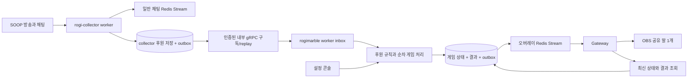

# 기존 저장소 조사와 초기 구상 기록

이 문서는 조사 근거를 보존한 기록이다. 현재 실행 순서와 완료 기준은 [구현 계획](implementation-plan.md)을 따른다.

작성: 2026-09-21. 현재 상태: 조사 완료, 초기 코어 작성, 서비스 구현 전.
이 문서에서 ‘확정’은 사용자 답변, ‘제안’은 코드 조사에 따른 설계 판단이다.

**최종 기준은 [최종 설계 v1](final-design.md)이다.** 이 문서는 초기 코드 조사와 이식 근거를 보관한다.
Lottie/Three.js, 두 EC2, Compose/IaC, private gRPC 전달은 최종 설계를 따른다.
관리 페이지는 [스트리머 운영 콘솔](operator-console.md)의 후원 내역·보상 수량 조정·수동 주사위·방향/위치
제어·운영 이력을 첫 출시 필수로 포함한다. 콘솔을 후속 설정 편집 기능만으로 취급하지 않는다.
초기 판은 추가 전달 이미지의 9×6 외곽 26칸이다. [보드 설계](board-design.md)의 타입·편집·실행 계약이 우선한다.

## 1. 확정한 요구사항

- `rogimarble`: 부루마블 형태의 방송용 주루마블. 설정·게임·브릿지·OBS 화면을 모노레포로 관리한다.
- `rogi-collector`: 별도 로기챗 공통 수집기. SOOP 방송 인식·채팅·후원을 수집하고 다른 제품도 사용할 수 있게 한다.
- 검증된 기존 구현을 최대한 활용하되, 대상 저장소에 private 원본 전체나 원본 이력을 초기에 공개하지 않는다.
- 첫 버전의 말은 **방송 전체가 함께 움직이는 말 하나**다.
- 후원 개수는 **정확히 일치**해야 한다. 초기 주사위 규칙은 33개이며 66/99개를
  자동 배수로 처리하지 않는다. 배수 계산·잔액·여러 후원 합산은 없다.
- 스트리머가 제공한 33/52/53/100/101/152/486 규칙은 초기 데이터다. 이름·개수·동작·
  미션 문구·아이템·실드 정책·이동 입력 방식을 웹 관리 콘솔에서 직접 관리해야 한다.
- 연차는 별도 기능이다. 활성화와 함께 개수별 횟수를 등록하며 기본 규칙에서 추론하지 않는다.
- 한잔 실드는 미션을 막는 아이템이다. '무조건 한잔해'에도 허용할지 운영자가 설정한다.
- 원하는 칸 이동은 운영자 화면 선택과 후원자 채팅 선택을 모두 지원한다.

위플랩 공식 FAQ도 개수별로 연차 횟수를 직접 설정하는 방식으로 설명한다.
이는 사용자 요구와 일치한다. [위플랩 FAQ](https://weflab.com/faq)

## 2. 레포 조사 결과와 재사용 판단

다섯 원본은 모두 로컬 clone했다. 대상 `rogimarble`은 기존 빈 Git 폴더를 원격에
연결하여 fetch했고, `rogi-collector`는 별도 clone했다. 두 대상 모두 원격 커밋이
없었다. 상세 파일 근거와 고정 SHA는 대상 밖의 로컬 조사 기록에 보관한다.

| 참고 레포 | 확인한 구조 | 가져올 부분 | 제외/재설계할 부분 |
| --- | --- | --- | --- |
| meloming-overlay | Next 16 / React 19, 토큰 URL, Socket.IO, snapshot 동기화 | OBS 투명 배경, 연결 상태, 재연결, 스냅샷 순서 비교, 위젯 shell | 노래 신청·가사·재생 도메인, 전체 테마/폰트/이미지 |
| meloming-gateway-service | Nest 11, Redis Streams, Socket.IO, 동기화 API, 채팅 bridge | 연결 lifecycle, stream 소비, 서버 상태 조회, 룸 전달, 헬스/메트릭 | playback 전용 로직, 토큰 검증 전 join, 게임을 chat bridge 수신에 의존시키는 구조 |
| meloming-back | Nest 11 / Prisma, 실제 datasource는 MySQL | 기본값/옵션 manifest, 설정 검증, 토큰 접근, outbox와 revision 패턴 | 기존 Prisma 스키마·migration 전체, 계정/결제/커뮤니티/노래 도메인 |
| meloming-chat-collector | 공개 Go workspace, PostgreSQL/Redis, 자체 proto | SOOP connector, discovery, 연결 manager, lease/heartbeat, 모델, 테스트 | 첫 릴리스에 불필요한 플랫폼/분석/배포 코드, 후원에 부적합한 손실 정책 |
| meloming-chat-service | 기존 private Go 수집기 | 운영 중 개선된 reconnect/handoff/storage 설계 비교 | private proto·운영 인프라 의존, 과거 전체 이력 |

현재 두 수집기는 모두 Go다. `chat-service`를 별도 Node 서비스로 새로 만들 이유는 없다.
공개 collector는 private service에서 분리된 코드이며, 메시지 모델과 publisher는
import 경로를 정규화하면 동일하다. 공개본에는 자체 proto, 입력/응답 크기 제한,
gRPC 인증과 SOOP 접속 대상 allowlist 등 추가 보완도 있다.

규모상 overlay는 추적 파일 1,868개 중 `public/` 자산이 1,655개이고,
backend는 2,889개다. 전체 복제 후 제품명만 바꾸면 주루마블과 무관한 코드와
자산이 대부분을 차지한다. 반면 gateway는 44개, 공개 collector는 164개여서
필요한 모듈을 선별해 기존 구조를 유지하는 이점이 크다.

### 선택: 선별 이식 + 일부 모듈 축소

| 접근 | 판단 |
| --- | --- |
| 모든 기능을 새로 작성 | 기존 장애 대응 경험을 버리고 SOOP 프로토콜을 중복 구현하므로 부적합 |
| 원본 전체 복사 → 커밋 → 불필요한 부분 삭제 | 첫 커밋/이력에 전체가 남으므로 요구사항 위반 |
| 대상 밖에서 원본을 축소한 뒤 필요한 파일만 이식 | 권장. gateway/collector에 특히 적합 |
| backend 전체를 로기챗으로 개명 | 도메인 결합이 크므로 비권장. 설정/실시간 기반만 추출 |

구체적인 이식은 `source-import-policy.md`의 파일별 허용 목록을 따른다.

## 3. 제안 구조

```text
rogimarble/
  apps/
    web/                  # Next: 설정 콘솔 + OBS 라우트
    api/                  # Nest: 설정, 세션, 게임 처리, collector 소비
    gateway/              # Nest: OBS Socket.IO와 상태 동기화
  packages/
    game-core/            # 후원 판정·주사위/칸 상태 전이의 순수 로직
    contracts/            # 설정/게임/오버레이 스키마와 런타임 검증
    overlay-ui/           # OBS shell, 연결 표시, 공통 표현
    database/             # 주루마블 전용 Prisma 스키마
  docs/

rogi-collector/
  discover/               # 등록 채널 방송 인식
  coordinator/            # 연결 소유권·워커 할당·복구
  worker/                 # SOOP 연결과 정규화
  query/                  # 상태/관리 API
  shared/                 # 공통 모델, 저장소, migration
  proto/                  # 자체 protobuf, 필요 RPC만
  contracts/              # 외부 소비 이벤트의 버전/합성 fixture
```

현재 실제 생성한 코드는 `packages/game-core`의 설정 검증/후원 판정·보드 타입/검증/좌표/경로 미리보기와 별도 초기 프리셋이다.
나머지 경로는 구현 순서에 따라 생성한다. 빈 앱을 완성된 것처럼 표시하지 않는다.

TypeScript 쪽은 pnpm workspace, 서버는 기존 Nest, 화면은 기존 Next를 사용한다.
초기에는 별도 빌드 오케스트레이터 없이 시작한다. 정확한 의존성 버전과 lockfile은
파일 이식 시 호환성·보안 상태를 확인해 고정한다. 원본의 버전을 최신 권장 버전으로 간주하지 않는다.

DB는 **PostgreSQL을 두 제품의 공통 운영 기반으로 사용하는 안**을 제안한다.
collector의 기존 PostgreSQL 저장소를 재사용할 수 있고, 주루마블 DB는 새로 만드는
작은 스키마라 MySQL 전체를 유지할 이점이 적다. 원본 MySQL migration은 가져오지 않는다.
최종 설계에서는 제품별 EC2 안에 독립 PostgreSQL·Redis를 두고 DB/role/migration/백업을 분리한다.
두 제품의 저장소를 공유하지 않는다.

초기 운영은 collector 각 역할 1개, API 1개, gateway 1개로 시작한다.
ClickHouse, 랭킹, 전 플랫폼 대량 수집, Kubernetes는 첫 연결 경로에 넣지 않는다.
Compose와 rogichat 패턴을 활용한 Terraform은 최종 설계의 운영 구현 범위에 포함한다.
일반 채팅 아카이브는 후속 단계에서 기존 ClickHouse batch writer를 선택적으로 가져온다.

## 4. 이벤트가 게임으로 이어지는 경로



**collector에는 주사위/보드/술 미션 로직이 없다.** 정규화된 사실만 발행한다.
주루마블이 후원을 해석하고 게임 결과를 만든다. Gateway는 인증·동기화·전달을 맡는다.
후원자 칸 선택용 채팅도 collector의 정규화 이벤트를 제품의 명령 처리기로 전달한다.
이 처리기는 채팅 userId를 해당 이동 요청의 donorId와 검증하고 OBS 접속 여부에 의존하지 않는다.
OBS가 닫혀 있어도 후원 수신과 서버의 게임 기록은 동작한다.

일반 채팅은 제한 길이 stream을 query가 gRPC로 중계한다. 후원은 collector DB journal/outbox를
통해 제공하고, 주루마블 worker가 inbox와 cursor를 내구성 있게 저장한 뒤 RPC ACK한다.
게임 processor는 inbox 처리와 게임 결과/outbox를 트랜잭션으로 확정한다.
inbox만 저장된 상태로 죽어도 미처리 항목을 다시 처리한다.
collector의 Redis 알림 누락이나 소비 중단은 journal 기반 후원 replay API/cursor로 복구한다.
그 API는 기존 query에 이미 있는 기능이 아니라 **새로 필요한 기능**이다.

일반 채팅의 손실 허용 정책을 후원에 적용하지 않는다. 후원 큐가 차거나 DB 저장에
실패하면 조용히 버리지 않고 제한된 재시도·지속 큐/spool·상태 저하와 gap 기록으로
드러낸다. 저장 성공 전 프로세스/디스크가 함께 죽는 구간이나 플랫폼 연결이 끊긴 동안의
미수신 후원까지 복원 가능하다고 약속하지 않는다. SOOP 원천 이벤트에 replay가 있는지는
실제 어댑터 검증이 필요하다.

### 기존 코드에서 반드시 바꿀 것

1. **후원 ID:** 현재 SOOP ID는 `채널 + 연결 내 순번`이어서 재시작 시 재사용될 수 있다.
   `eventId`는 영속 수락 시 고정하고 재발행에도 유지한다. 원천 고유 ID가 있으면 별도
   `sourceEventId`로 보존한다. 없으면 connection epoch/sequence로 충돌을 막되, 이것만으로
   서로 다른 연결에서 받은 동일 실제 후원의 중복까지 제거된다고 주장하지 않는다.
2. **중복과 handoff:** 현재 raw hash + 짧은 TTL은 같은 내용의 정상 연속 후원을
   합칠 수 있다. 일반 채팅용 중복 억제를 후원에 그대로 쓰지 않는다. 초기 후원 채널은
   단일 활성 소유자와 fencing을 적용한다. 원천 ID 없는 reconnect 중복은 합성/실제 익명화
   패킷으로 판단 가능한 필드를 확인하고, 불명확한 경우 검토 기록으로 남긴다.
3. **버퍼/발행 오류:** 현재 connector는 꽉 찬 채널에서 drop하고 manager는 Redis 오류를
   기록한 뒤 다음 메시지로 진행한다. 후원 경로에는 별도 저장·재시도를 넣는다.
4. **후원 종류:** 여러 SOOP 명령을 하나의 donation/currency로 묶고 있어 별풍선·미션·다른
   아이템을 오인할 수 있다. 정규화 단계에 명시적 `donationKind`를 추가한다.
   초기 자동 실행 대상은 확인된 일반 별풍선 이벤트로 제한하고 미션 중복 집계는 별도 검증한다.
5. **gateway 동작:** README는 consumer-group 중심이지만 현재 코드 기본은 broadcast다.
   주루마블 호스트 내부 gateway는 `XREADGROUP + local emit`으로 단일 인스턴스를 시작한다.
   다중 gateway로 확장할 때 Socket.IO Redis adapter를 추가하며 `각 pod XREAD + local emit`과 섞지 않는다.
   collector 후원 소비는 최종 설계의 gRPC/journal cursor이며 gateway consumer group과 별개다.
6. **브라우저 수신:** Redis ACK나 socket emit은 OBS 표시 완료가 아니다.
   앱이 revision과 저장된 결과로 복구해야 한다. Socket.IO 기본 전달은 at-most-once이고
   일반 Redis adapter는 connection state recovery를 지원하지 않는다.
   [전달 보장](https://socket.io/docs/v4/delivery-guarantees/),
   [Redis adapter](https://socket.io/docs/v4/redis-adapter/)
7. **스냅샷 병합:** 원본 playback outbox는 최신 전체 snapshot으로 중간 revision을
   생략할 수 있다. 말의 현재 위치는 병합 가능하지만 주사위 각각의 결과·연차 순서는
   별도 결과 테이블에 전부 저장해야 한다.

## 5. 계약과 데이터 모델

collector의 외부 v1 이벤트는 `schemaVersion`, `eventId`, `type`, `platform`,
`platformChannelId`, `broadcastId`, `sourceEventId?`, `observedAt`, `occurredAt?`,
`connectionEpoch`, `sourceSequence`, `donationKind`, `amount`, `currency`,
`donorId`, `donorName`, `message`를 정의한다. 플랫폼이 주지 않는 방송/시각 값은
없음으로 표현하고 수신 시각과 혼동하지 않는다.

`amount`는 `SOOP_BALLOON`의 양의 정수 개수다. 원화 추정액으로 규칙을 계산하지 않는다.
raw packet과 원문 인증 정보는 OBS 이벤트에 싣지 않는다.
원천 메시지 구조와 게임 이벤트 구조를 한 타입에 섞지 않는다.

공통 소비 계약은 collector의 버전 있는 schema/합성 fixture를 기준으로 하고,
주루마블은 고정한 계약 버전을 검증한다. 런타임에 sibling 디렉터리나 private
`dylabs-proto`를 참조하지 않는다. Go/TS 간 nullable/정수/시각 표현을 fixture로 검증한다.

| 주루마블 모델 | 책임과 핵심 제약 |
| --- | --- |
| Channel / ChannelBinding | 운영자 소유권, SOOP 채널 매핑 |
| BoardPreset / BoardCell | 칸 순서·이름·미션·스타일. 동작 enum과 payload 검증 |
| GameConfig | 채널별 편집 가능한 설정과 revision, 변경 이력 |
| DonationRule | 정확한 개수, 이름, enabled, 범용 action과 매개변수. 한 설정 내 개수 중복 금지 |
| GameSession | 상태, 공유 말 위치, lap, 단조 sessionEpoch/revision, 보드 snapshot과 활성 설정 버전 |
| DonationInbox | consumer + eventId 유일성, 원천 시각, 수락 시 대상 session, 처리 상태/사유 |
| ActionRequest | 후원별 동작 snapshot, 처리 상태, 설정 버전; 주사위/미션/아이템/이동 구분 |
| RollRequest / RollResult | 원인 후원, rule/config version, 연차 index, 주사위 눈·이동 경로·도착 결과 |
| MissionInstance / InventoryEntry | 미션별 실드 정책 snapshot, 아이템 잔량, 지급/사용 이력 |
| MoveRequest | 후원자, 세션/보드, 선택 입력 방식, pending/resolved/cancelled/expired; 1회 확정 |
| GameOutbox | 결과 전달 의도, 재시도·lease, eventId 유일성 |
| OverlayAccess | 읽기 전용 토큰 hash, channel scope, 만료/회수/재발급 |
| OperatorCommand | 수동 진행·이동·취소 등의 명령 idempotency key와 이력 |

후원은 수락 시 세션과 설정 버전에 묶는다. 재시작 후 현재 세션으로 재할당하지 않는다.
게임이 종료된 동안의 후원을 다음 게임에서 뒤늦게 굴리지 않는다. 연결 장애로 지연 도착한
이벤트의 원천 세션을 확인할 수 없으면 검토 대상으로 두고 자동 실행하지 않는다.
스키마, 소유권, event ID를 검증하기 전에는 inbox의 처리 완료로 표시하지 않는다.

## 6. 게임 규칙과 화면

초기 규칙은 [프리셋 데이터](../presets/streamer-initial.json)에 있다.
웹 콘솔의 입력·DB 저장·실드/이동 처리는 [설정 관리 설계](configuration-management.md)를 따른다.

| 후원 | 초기 동작 |
| --- | --- |
| 33개 | 주사위 굴리기 1회 |
| 52개 | 안주 먹어 |
| 53개 | 안주 안돼 |
| 100개 | 무조건 한잔해 |
| 101개 | 한잔 실드 |
| 152개 | 같이 한잔 |
| 486개 | 원하는 칸으로 |
| 66/99/200/250개 등 미등록 개수 | 동작 없음 |

주사위 외 후원은 해당 동작만 요청하며 추가 주사위를 굴리지 않는다. 프리셋은 처음
설정할 때 가져오는 데이터이고 실행 코어의 기본값이 아니다. 실행 시 채널의 저장된
설정을 사용한다. 화면에서 규칙을 바꾸면 재배포 없이 반영하고 재시작 후에도 유지한다.
등록된 33을 변경하면 이전 33 규칙이 코드에 남아서 계속 작동해서는 안 된다.

미션에는 실드 불허 또는 사용할 아이템/소모 개수를 설정한다. 표시 이름의 '무조건'
여부로 분기하지 않는다. 한잔 실드 1개 지급, '무조건 한잔해' 방어 불허, '같이 한잔'
방어 허용은 현재 프리셋의 편집 가능한 제안값이며 확정된 방송 규칙으로 간주하지 않는다.

486은 운영자/후원자 채팅을 모두 허용하는 이동 요청이다. 해당 후원자의 플랫폼 ID와
유효 칸을 검증하고, 같은 요청은 웹/채팅 경합에서도 한 번만 확정한다. 명령어와
허용 입력 방식도 편집 가능한 데이터다.

연차는 N개의 주사위 요청을 순서대로 처리한다. 한 번의 이동 거리를 N배로 만들지 않는다.
설정 변경이 이미 수락한 연차의 남은 횟수에 소급 적용되지 않도록 당시 규칙을 보관한다.
한 후원은 하나의 활성 규칙에만 대응하고, UI 저장과 서버 검증에서 중복 개수를 거부한다.

주사위 눈은 서버가 생성하고 결과 저장 이후에 표시한다. 재시도 시 다시 뽑지 않는다.
공유 말의 모든 상태 변경은 세션 단위 직렬화/DB 잠금으로 처리한다.
`rollRequestId + index` 유일성으로 worker 재시작 뒤 같은 주사위를 중복 처리하지 않는다.
수동 조작도 같은 명령 경로로 들어오며 표시용 애니메이션 callback에 게임 진행을 맡기지 않는다.

**제안하는 초기 게임 범위:** 6면 주사위 2개 합산(후속 무인도 요구 반영; 편집 가능), 순환 보드, 텍스트 미션 칸, 공유 말 1개,
시작/일시정지/한 건 진행/재개/종료, 대기열, 후원 내역, 보상 수량 조정, 수동 주사위,
진행 방향 변경, 수동 위치/거리 보정, 테스트 후원,
설정 가능한 미션/실드, 운영자·채팅 칸 선택.
이번 칸 수/배치/문구는 전달 이미지의 26칸 프리셋을 기준으로 한다. 주사위 개수/더블과
특수칸은 후속 답변에 따라 적립 +1잔·전량 청산·다음 이동 ×2·무인도/여행 규칙으로 설정했다. 최종 타입·차례 계약은 보드 설계를 따른다.
술 미션은 운영자가 작성·확인하는 텍스트로 시작한다.

일시정지는 새 주사위 실행을 멈추고 후원 요청은 큐에 보관하는 안을 제안한다.
취소는 기록을 지우는 대신 취소 명령/사유를 남긴다. 테스트 후원은 실제 수집 이벤트와
명확히 구분하고 별도 preview session에서만 실행한다.

OBS 화면은 `/overlay/:overlayId#token=...`, 콘솔은 별도 route group/layout을 사용한다.
원본의 투명 배경 전역 스크립트를 그대로 root layout에 넣으면 설정 화면까지
투명해지므로 OBS layout에만 적용한다. 외부 자산 전체 복제 대신 기본 보드를 새로 만든다.
custom CSS와 iframe preview는 후속 기능으로 두고 도입 시 postMessage origin/source를 검증한다.

재접속 시 `(sessionEpoch, revision)`의 최신 상태와 미표시 결과를 받는다.
이전 세션이나 낮은 revision을 무시하고 gap이면 재동기화한다. 최초 새 브라우저는
현재 상태부터 표시하고, 재접속한 브라우저의 애니메이션 replay는 저장 cursor와
제한 개수/시간 정책을 따른다. 최종 위치 복원과 과거 애니메이션 재생을 구분한다.
브라우저 두 개를 열어도 게임은 한 번만 진행한다.

## 7. 접근 권한과 운영 경계

- 콘솔의 설정/수동 조작에는 운영자 인증과 채널 소유권 검증을 적용한다.
  최초에는 배포 관리자가 승인한 채널 연결로 시작하고, 자동 가입/OAuth는 별도 범위다.
- OBS 토큰은 조회·구독만 허용한다. gateway는 token을 검증한 뒤 내부 channel/session 룸에 join한다.
  URL을 안다고 설정이나 주사위 API를 호출할 수 없어야 한다.
- 로그·Redis routing key·메트릭에는 원문 OBS token을 넣지 않는다.
  토큰 회수 시 열린 socket과 캐시도 회수/만료 경로를 가진다.
- 서비스간 API key는 환경별로 분리하고 Redis는 내부망에서 역할별 권한을 사용한다.
- 수집 대상은 등록한 SOOP 채널만. 기존 allowlist는 재사용하되 전체 방송 목록을 먼저
  순회하는 비용은 남으므로 소규모 첫 단계는 단일 채널 live-check 경로를 활용한다.
- 설정 없는 상태는 플랫폼/채널 전체 수집으로 확장하지 않는다. opt-out/중지 처리를 유지한다.
- 필수 메트릭: 수집 연결 상태, 마지막 이벤트 시각, 저장 실패, 후원 backlog,
  중복/불명확 이벤트, 게임 처리 지연, OBS 재동기화 횟수.

## 8. 구현 순서와 완료 기준

| 단계 | 작업 | 완료 기준 |
| --- | --- | --- |
| 0 · 초기 작업 | 대상 2개·meloming 참고 5개 로컬 준비, 조사, 분리 정책, 계획, 후원 판정 코어 | private 코드/이력 혼입 없음, 정확 개수·연차 회귀 테스트 통과 |
| 1 · 공통 기반과 설정 저장 | schema/fixture, Nest/Next workspace, DB 설정 저장/조회, 최소 웹 규칙 편집, 새 CI, 이식 manifest | 재현 가능한 빌드, 규칙 추가/수정/삭제/비활성화가 재배포 없이 저장되고 재시작 후 유지 |
| 2 · 수집기 최소 경로 | SOOP 모듈 선별 이식, 등록 채널, 연결 복구, 후원 영속 수락/outbox/replay | 합성 패킷부터 소비자까지 ID 유지, Redis 중단 후 재발행, live-check 복구 |
| 3 · 서버 게임 | 세션·공유 말·후원 inbox·설정별 동작·연차 queue·미션/실드·이동 요청·결과/outbox | 중복 실행/차감 없음, 정책 변경 반영, 웹/채팅 경합 시 한 번만 이동 |
| 4 · OBS 브릿지 | gateway 선별 이식, 읽기 토큰 검증, snapshot/resume, 새 보드 UI | 2개 브라우저가 같은 상태, 재접속/역순 이벤트로 말이 되돌아가지 않음 |
| 5 · 설정 콘솔 확장 | 기본값 manifest, 보드 칸 편집, 미리보기, 아이템/미션/이동 대기열, 수동 조작 | 저장/검증/OBS 반영 일치, 게임 중 보드 변경과 테스트 후원 격리 |
| 6 · 실방송 검증 | 승인된 테스트 채널로 관측, 재연결·부하·장애 검증, 문서화 | 원천 packet 의미 확인, 장애/미수신 한계와 운영 복구 절차 확인 |

각 단계는 동작 가능한 최소 단위로 가져온다. 원본 전체 복사부터 시작하지 않는다.
이 표는 초기 순서이며 추가 조사한 rogichat/rogichat-ops와 Lottie·Compose·IaC를 포함한 실제 작업 순서는
[최종 설계의 구현 단계](final-design.md#11-구현-순서와-출시-기준)를 따른다.
현재 구현 순서는 **계약 → 실제 운영 콘솔·수동 서버 조작·기본 OBS → 수집기 → 후원 내역/게임 통합**이다.
보상 조정·수동 주사위·방향/위치 제어를 실제 세션에 먼저 연결하고 수집 후원과 같은 명령 기반을 사용한다.
채팅 아카이브, 다양한 테마, 다른 플랫폼은 그 다음이다.

### 필수 회귀/통합 시나리오

- 초기 7개 규칙: 33은 주사위, 나머지는 지정 동작만. 66/99/200/250는 미동작.
- 33을 34로 변경한 설정에서는 33 미동작, 34 정상. 여러 후원의 누적 없음.
- 미션별 실드 허용/불허, 잔량 부족, 재시도·동시 사용에서 중복 차감 없음.
- 운영자/후원자 채팅 모두 칸 선택 가능. 다른 사람·만료·중복·잘못된 칸 입력 거부.
- 설정 revision 충돌, 저장 후 재시작, 프리셋 재적용이 사용자 수정을 자동 덮어쓰지 않음.
- 연차 비활성/활성, 별도 등록 없는 배수, 중복 개수 설정 거부.
- 똑같은 내용으로 들어온 별개의 정상 후원 2건은 2건으로 유지.
- 같은 eventId 재배달은 한 번만 수락; 프로세스 재시작 후 새 후원 ID 충돌 없음.
- DB 커밋 직후/Redis 발행 직후 죽어도 결과 재추첨 없음.
- OBS 미접속, 두 브라우저 접속, reconnect, 중복/역순 snapshot, 세션 변경.
- 잠시 멈춘 세션, 종료된 세션, 지연 도착 후원, 진행 중 설정 변경, 연차 중 재시작.
- SOOP 일반 별풍선과 미션/기타 아이템 구분, 분할/다중 packet·잘못된 개수 처리.
- 일반 채팅 폭주가 후원 저장을 잠식하지 않음; 큐 한계는 지표와 실패 상태로 노출.
- 잘못된/회수한 OBS token, 다른 채널 접근, OBS token으로 쓰기 명령 시도 거부.

## 9. 아직 열려 있는 결정과 검증 한계

- 주사위 개수와 특수칸 세부 동작. 후원 초기 7개 개수와 이미지 기준 26칸 배치/문구는 정해짐.
- 실드 정책의 초기 제안값, 안주 미션의 지속/해제 조건, 목적지 이동의 도착 칸/출발점 처리.
- 연차 UI를 첫 출시에서 켤지, 수동 조작/미션 완료가 다음 주사위를 언제 진행시킬지.
- 일반 채팅 원문 보존 기간, 대상 방송 규모, 리전·도메인·인스턴스 용량. 배포 형태는 제품별 EC2 1대·Compose로 결정됨.
- 실제 SOOP 원천 고유 ID/방송 구분/미션 중복 여부는 현재 코드만으로 확정할 수 없다.
- 공개 collector의 AGPL 표기와 실제 이식 파일의 권리/고지를 기록해야 한다.

기존 문서만 믿지 않고 실제 코드와 비교했다. 특히 gateway의 기본 모드, backend의
DB provider, private/public collector 차이는 README와 다르거나 문서가 오래된 부분이다.
원본 빌드·실서버 실행·운영 DB 접근·실제 후원은 수행하지 않았다. 기존 AGENTS가 금지한
참조 Node 빌드/개발 서버도 실행하지 않았다. 원본 전체의 버그/비밀정보 감사가 완료되었다는 뜻은 아니다.
